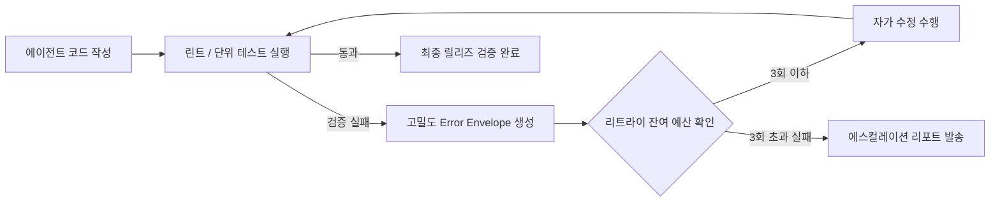

# 07_QA.md

---

# [가이드] 범용 품질 보증 및 자가 치유 폐루프 표준 (Universal QA Guide)

---

## 1. 개요 및 목적
본 문서는 모든 소프트웨어 프로젝트에서 회귀 버그를 사전에 기계적으로 차단하고, 파이프라인 검증 실패 시 에이전트가 스스로 원인을 분석하여 해결하는 **자가 치유 폐루프(Self-Repair Closed Loop)와 품질 보증(QA) 표준**을 정의합니다.

---

## 2. 자가 치유 피드백 루프 (Self-Repair Protocol)
테스트나 린트 단계에서 결함이 발생했을 때 사람이 수동으로 코드를 고치지 않으며, 아래와 같은 자동화 루프로 자체 수렴시킵니다.



### 에러 피드백 규격 (Error Envelope Specification)
원시 터미널 로그의 노이즈를 제거하고 핵심 결함 정보만을 추출하여 에이전트에 역주입합니다.

```json
{
  "status": "VALIDATION_FAILED",
  "stage": "LINT | UNIT_TEST | INTEGRATION_TEST",
  "violations": [
    {
      "file": "src/domain/target_file.ts",
      "line": 45,
      "rule": "RULE_NAME",
      "expected": "정상 기대값 또는 허용 기준",
      "actual": "실제 발생한 에러 메시지 또는 위반 내용"
    }
  ],
  "retryBudget": { "attempt": 1, "maxAttempts": 3 },
  "instruction": "기존 비즈니스 로직 및 인터페이스를 보존하면서 위반된 규칙을 만족하도록 리팩토링하라."
}
```

---

## 3. 최종 검증 프로토콜 (Final Validation Protocol)
작업 완료를 선언하기 전, 다음 5단계 검증 파이프라인을 무조건 순차 재실행하여 통과해야 합니다:
1. **린트 재실행**: 코드 스타일 및 안티패턴 점검
2. **정적 분석 재실행**: SonarQube / CodeQL 기반 보안 취약점 및 복잡도 점검
3. **단위/통합 테스트 재실행**: 전체 테스트 통과 및 도메인 커버리지 80% 이상 확인
4. **데드 코드 및 메모리 누수 점검**: 미사용 import, 불필요한 전역 객체 제거
5. **Warning 0, Error 0 확정**: 단 하나의 경고도 없는 완전 무결점 상태 확인

---

# [템플릿] 프로젝트 테스트 전략 및 계획서 (Test Strategy Template)
*신규 프로젝트 착수 시 QA 엔지니어가 프로젝트 특성에 맞춰 작성하는 양식입니다.*

```markdown
---
project_name: "{{프로젝트명}}"
version: "1.0.0"
target_coverage: "80%"
last_updated: "{{YYYY-MM-DD}}"
---

# 1. 테스트 피라미드 구성 및 도구 매핑

| 테스트 계층 | 검증 목적 | 채택 프레임워크 | 실행 시점 |
| :--- | :--- | :--- | :--- |
| **Unit Test** | 도메인 핵심 비즈니스 로직 검증 | {{Jest / JUnit / Pytest / Go test}} | 커밋 전 상시 |
| **Integration Test** | DB 트랜잭션, 외부 API 모킹 연동 검증 | {{Testcontainers / Supertest}} | PR 생성 시 |
| **E2E Test** | 핵심 사용자 흐름(로그인, 결제 등) 검증 | {{Playwright / Cypress}} | Staging 배포 시 |
| **Load Test** | 동시 부하 및 p95 응답 속도 검증 | {{k6 / Artillery}} | 릴리즈 직전 |

# 2. 필수 검증 시나리오 목록 (Critical Test Cases)
- [ ] **정상 흐름 (Happy Path)**: {{가장 빈번한 핵심 비즈니스 로직의 정상 입출력 검증}}
- [ ] **경계값 및 유효성 (Boundary Cases)**: {{비정상 파라미터, 누락 필드에 대한 400 에러 처리}}
- [ ] **동시성 제어 (Concurrency)**: {{동일 리소스에 대한 동시 요청 시 데이터 정합성 보장 여부}}
- [ ] **장애 격리 (Resilience)**: {{외부 연동 API 장애 시 서킷 브레이커 Fallback 정상 동작 여부}}

# 3. 최적화 및 리팩토링 절대 원칙
- **기능 변경 절대 금지 (No Behavioral Modification)**:
  성능 최적화(인덱스 튜닝, 캐싱, 쿼리 개선)나 리팩토링 단계에서는 기존 기능의 동작이나 반환값을 절대 변경할 수 없으며, 최적화 전/후 단위 테스트 결과가 완벽히 일치해야 한다.

# 4. 에스컬레이션 리포트 양식 (3회 리트라이 연속 실패 시)
- **실패 단계**: {{LINT | BUILD | TEST}}
- **시도 횟수**: 3 / 3 (리트라이 예산 소진)
- **근본 원인 분석**: {{아키텍처 불일치, 외부 의존성 충돌, 명세 모호성 등}}
- **담당 엔지니어 조치 요청 사항**: {{스펙 조정 또는 하네스 룰 예외 검토 요청}}

---