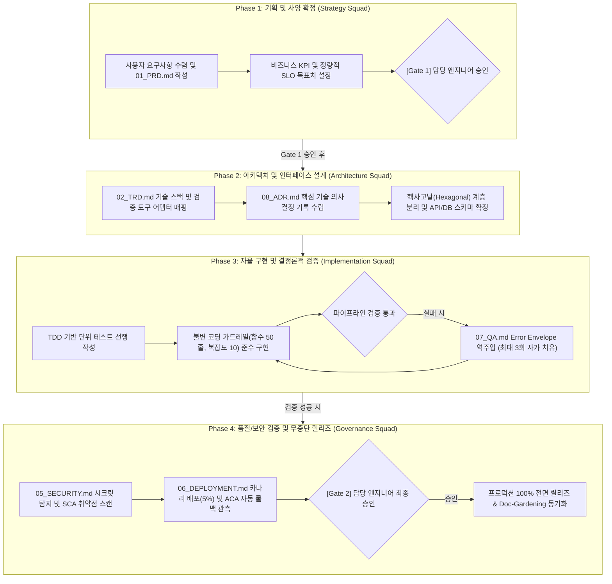

# Developer

---

# AI 에이전트 자율 개발을 위한 범용 하네스 엔지니어링 프레임워크

---

# 1. 개요 및 목적
본 문서는 OpenAI의 공식 하네스 엔지니어링(Harness Engineering) 표준을 기반으로, **어떠한 도메인과 기술 스택(Web, Mobile, Cloud Native, AI/ML, Embedded, CLI 등)의 소프트웨어 프로젝트에도 100% 범용 적용할 수 있도록 설계된 마스터 엔지니어링 프레임워크이자 운영 가이드**입니다.

새로운 프로젝트를 기획하고 개발할 때, AI 에이전트와 담당 엔지니어는 본 프레임워크와 하위 `01` ~ `08` 문서를 복제하거나 참조하여 기획부터 아키텍처 설계, 자율 구현, 무중단 배포까지 일관된 고품질 파이프라인을 즉시 구축할 수 있습니다.

**원칙과 규칙을 정의하는 '메타 가이드라인'**과 신규 프로젝트 착수 시 본 프레임워크와 하위 `01` ~ `08` 문서를 복제하거나 참조하여 **'실행 템플릿'**의 이중 구조로 설계되어 있어, 향후 진행할 모든 소프트웨어 기획과 자율 구현의 견고한 엔지니어링 환경(Scaffolding)을 제공합니다.

```text
[Universal Meta-Harness Framework]
                 │
                 ▼ (신규 프로젝트 착수 시 인스턴스화)
┌─────────────────────────────────────────────────────────────┐
│ 01_PRD.md        → 비즈니스 요구사항 정의 및 [Gate 1] 기획 승인   │
│ 02_TRD.md        → 기술 스택 매핑, 결정론적 가드레일, API 스키마  │
│ 03_RULES.md      → 하네스 운영 핵심 원칙 및 변경 관리 규정       │
│ 04_ROLES.md      → 심포니 4대 스쿼드 오케스트레이션 및 핸드오프  │
│ 05_SECURITY.md   → 제로 트러스트 보안, 에이전트 샌드박스, SCA    │
│ 06_DEPLOYMENT.md → 카나리 무중단 배포, ACA 자동 롤백, [Gate 2]   │
│ 07_QA.md         → 자가 치유 폐루프(Error Envelope), 최종 검증   │
│ 08_ADR.md        → 아키텍처 결정 기록(ADR) 및 기술 부채 통제     │
└─────────────────────────────────────────────────────────────┘
```

---

# 2. 하네스 엔지니어링 4대 핵심 운영 원칙
$$\text{자율 소프트웨어 시스템} = \text{파운데이션 모델 (LLM)} + \text{하네스 (환경 · 도구 · 레일 · 피드백)}$$

1. **엔지니어 조율, 에이전트 실행 (Humans Steer, Agents Execute)**
   담당 엔지니어(사람)는 요구사항 정의와 두 차례의 핵심 승인 관문([Gate 1] 기획 승인, [Gate 2] 릴리즈 승인)만을 총괄하고, 코드 작성과 단위 테스트는 에이전트가 100% 자율 수행합니다.

2. **수동 패칭 금지 원칙 (Fix the Harness, Never Patch Code)**
   에이전트가 생성한 코드에 결함이 발생했을 때 사람이 코드를 직접 수정하지 않습니다. 누락된 린터 룰, 정적 타입, 스키마, 테스트 케이스 등 **하네스 환경을 보강하여 에이전트가 스스로 수정(Self-Repair)**하도록 시스템을 개선합니다.

3. **결정론적 검증 우선 (Deterministic Rails over Prompt Guesswork)**
   프롬프트의 확률적 추론이나 모호한 권고에 의존하지 않고, 정적 분석 도구, 컴파일러, 아키텍처 검증(ArchUnit)을 통해 허용되지 않은 패턴을 빌드 단계에서 기계적으로 차단합니다.

4. **코드-문서 지속 동기화 (Continuous Doc-Gardening)**
   코드가 발전함에 따라 문서가 낡아버린 문서 부채(Documentation Rot)를 방지하기 위해, 코드 변경 시 관련 문서(`PRD`, `TRD`, `ADR`, `API`)를 백그라운드에서 상시 자동 동기화합니다

---

# 3. 프로젝트 부트스트랩 4단계 라이프사이클
어떤 신규 프로젝트를 시작하든 에이전트는 다음 4단계를 순차적으로 완료해야 합니다.



### Phase 1: 기획 및 스펙 고정 (Strategy Phase)
1. 사용자의 요구사항을 수렴하여 [PRD.md]의 템플릿을 완성한다.
2. 정량적 SLO, 비즈니스 KPI, MVP 개발 범위를 확정한다.
3. **[Gate 1] 담당 엔지니어의 명시적 승인을 획득한다.** (승인 전까지 코드 작성 금지)

### Phase 2: 기술 아키텍처 및 인터페이스 설계 (Architecture Phase)
1. 프로젝트 특성에 최적화된 스택을 선정하고 [TRD.md]에 도구 매핑 테이블을 작성한다.
2. 핵심 아키텍처 결정 사항을 [ADR.md]에 기록한다.
3. 헥사고날(Hexagonal) 계층 분리 경계와 API/데이터 스키마를 확정한다.

### Phase 3: 자율 구현 및 결정론적 검증 (Implementation Phase)
1. TDD 원칙에 따라 실패하는 단위 테스트를 먼저 작성한다.
2. 불변 코딩 기준(함수 50줄, 복잡도 10 이하, Warning 0)을 준수하며 구현한다.
3. 컴파일 또는 린트 실패 시 [QA.md]의 **Error Envelope**를 통해 최대 3회 자가 치유를 수행한다.

### Phase 4: 종합 품질 검증 및 무중단 배포 (Governance Phase)
1. [SECURITY.md]의 시크릿 탐지 및 오픈소스 SCA 취약점 스캔을 통과한다.
2. 단위 테스트 커버리지 80% 이상 및 Final Validation Protocol을 완료한다.
3. [DEPLOYMENT.md]에 따라 카나리 배포(5%) 및 실시간 텔레메트리 관측(ACA)을 수행한다.
4. **[Gate 2] 담당 엔지니어의 최종 승인을 거쳐 100% 프로덕션으로 전면 전환한다.**

---

# 4. 스택 무관 절대 품질 기준 (Universal Invariant Rails)
어떤 언어나 프레임워크를 도입하더라도 예외 없이 강제되는 엔지니어링 불변 규칙입니다:

| 규칙 항목 | 상한 기준 | 기계적 강제 메커니즘 |
| :--- | :--- | :--- |
| **함수/메서드 길이** | 최대 50줄 이하 | 언어별 AST 린터 (`max-lines-per-function` 등) |
| **클래스/파일 길이** | 최대 300줄 이하 | 정적 분석 도구 (`max-lines` 등) |
| **중첩 깊이 (Depth)** | 최대 3단계 이하 | 린터 `max-depth` 에러 처리 |
| **순환 복잡도 (Complexity)** | Cyclomatic 10 이하 | 린터 `complexity` 에러 처리 |
| **빌드 경고 허용치** | **Warning 0, Error 0** | CI 빌드 플래그 (`--max-warnings=0`, `-Werror` 등) |
| **도메인 계층 격리** | 순수 도메인의 외부 인프라 import 금지 | 아키텍처 테스트 도구 (`ArchUnit`, `dependency-cruiser`) |
| **테스트 커버리지** | 핵심 비즈니스 로직 80% 이상 | CI 커버리지 게이트 |

---

# 5. 하네스 오케스트레이션 실행 가이드
신규 프로젝트 진행 시 아래 절차로 에이전트에게 작업을 디스패치합니다:

```bash
# 1. Strategy Squad 기획 착수
# "01_PRD.md 템플릿에 맞춰 [PRD.md]에 대한 비즈니스 목표와 SLO를 정의하라."

# 2. Architecture Squad 기술 설계
# "01_PRD.md 템플릿에 맞춰 [PRD.md]에 대한 승인 사양을 바탕으로 TRD.md와 ADR.md에 헥사고날 구조와 스택 도구 매핑을 설계하라."

# 3. Implementation & Governance 자율 구현 및 검증
# "02_TRD.md 템플릿에 맞춰 인터페이스 계약을 준수하여 TDD 단위 테스트와 비즈니스 로직을 구현하고, Warning 0 검증을 통과하라."

# 4. Doc-Gardening 문서 최신화
# "구현된 코드베이스를 기반으로 .GEMINI/ 폴더의 `01` ~ `08` 템플릿 가이드를 기반으로 PRD, TRD, ADR 문서 동기화 상태를 최종 검증하라."
```

모든 세부 운영 규칙과 실행 템플릿은 [.GEMINI/] 폴더에 모듈화되어 있습니다:

1. [01_PRD.md]: 범용 제품 요구사항 정의서 가이드 및 템플릿 (SLO, KPI, [Gate 1] 승인 체크리스트)
2. [02_TRD.md]: 범용 기술 상세 설계서 가이드 (스택 어댑터 매핑, 결정론적 가드레일, Error Envelope 규격)
3. [03_RULES.md]: 범용 협업 운영 헌장 (수동 패칭 금지, 작업 단위 200줄 제한, 변경 관리 기준표)
4. [04_ROLES.md]: 범용 심포니 4대 스쿼드 오케스트레이션 (Strategy $\rightarrow$ Architecture $\rightarrow$ Implementation $\rightarrow$ Governance 핸드오프 계약)
5. [05_SECURITY.md]: 범용 제로 트러스트 보안 및 샌드박스 규격 (Pre-commit 시크릿 차단, SCA, 민감정보 마스킹)
6. [06_DEPLOYMENT.md]: 범용 무중단 배포 및 자동 롤백 가이드 (ACA 실시간 텔레메트리 관측, [Gate 2] 승인)
7. [07_QA.md]: 범용 자가 치유 폐루프 및 테스트 표준 (Error Envelope 스키마, 3회 리트라이 예산, 최종 검증 프로토콜)
8. [08_ADR.md]: 범용 아키텍처 결정 기록 가이드 및 템플릿 (기반 아키텍처 결정 ADR-0001~0003 기본 탑재)

---