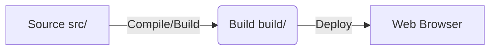

# 프로젝트 : Developer Portfolio Blog

---

## 1. 프로젝트 소개
개발자로서의 정체성 보유 기술 주요 프로젝트를 인터랙티브하게 표현하여 전문성을 홍보하는 개인 포트폴리오 정적 블로그 서비스입니다

---

## 2. 프로젝트 개요
- **제작 배경**: 개발자로서의 활동과 기술 역량을 체계적으로 정리하기 위해 시작했습니다
- **기획 의도**: 방문자에게 전문적인 인상을 주고 다양한 디바이스에서 최적화된 포트폴리오를 제공하고자 했습니다
- **프로젝트 목표**: 모던한 UI 디자인과 반응형 웹 기술을 활용하여 높은 가독성과 사용자 편의성을 갖춘 포트폴리오 웹사이트 구축을 목표로 합니다

---

## 3. 주요 기능
- **동적 내비게이션**: 스크롤 상태에 따라 내비게이션 바의 크기가 축소/확장되어 사용자 경험을 최적화합니다
- **포트폴리오 모달 상세 보기**: 프로젝트 5개(Matrix Calculator, Kiosk, Note Pad, Movie Box, Ssn)를 클릭하면 모달창으로 상세 설명
- **스킬 스택 시각화**: 12개 스킬(HTML, JavaScript, CSS, Node.js, Sass, Ajax, Pug, jQuery, MySQL, TypeScript, Java, JSON)을 아이콘으로 보여주고 클릭 시 모달로 상세히 설명합니다
- **About 섹션**: 이름, 연락처, 학력과 교육 이력을 소개합니다
- **반응형 웹 지원**: 모바일에서 데스크톱 환경까지 다양한 디바이스에 완벽하게 대응하는 레이아웃을 제공합니다

---

## 4. 기술 스택
- **Markup**: Pug (HTML Preprocessor)
- **Styling**: CSS (Bootstrap 5 기반 Start Bootstrap 템플릿을 인용하여 제작 빌드 CSS에 Bootstrap 스타일 포함)
- **Script**: JavaScript (ES6+), Bootstrap 5 JS (CDN)
- **Icons**: Font Awesome 6
- **Fonts**: Google Fonts (Montserrat, Lato)

---

## 5. 기술 선택 이유
- **Pug**: 믹스인(Mixin) 기능을 통해 HTML 코드를 컴포넌트화하여 유지보수성을 극대화했습니다
- **Bootstrap 5**: 검증된 레이아웃 컴포넌트를 활용하여 개발 속도를 향상하고 일관된 디자인을 유지합니다
- **JavaScript**: 내비게이션 축소, ScrollSpy, 모바일 메뉴 접힘 등 스크롤 이벤트 처리를 바닐라 JS로 구현했습니다

---

## 6. 시스템 아키텍처
- 별도의 백엔드 서버 없이 동작하는 고성능 정적 웹사이트입니다
- `src/` (소스) -> `build/` (컴파일 결과물) 구조를 통해 배포 효율성을 높였습니다



---

## 7. 프로젝트 폴더 구조
```text
blog2/
├── README.md
├── build/
│   ├── css/
│   ├── html/
│   └── script/
├── public/
│   ├── favicon/
│   └── img/
└── src/
    ├── css/
    ├── pug/
    └── script/
```

---

## 8. 트러블 슈팅
- **문제**: 포트폴리오 항목 증가에 따른 HTML 코드 비대화 및 가독성 저하
- **원인**: 반복적인 모달 구조 마크업이 전체 가독성을 해침
- **해결**: Pug의 `mixin` 기능을 도입하여 `portfolio-item` · `portfolio-modal` · `skill-item` · `skill-modal`을 모듈화하여 코드 중복을 제거함

---

## 9. 성능 개선
- **성능 개선 포인트**: 첫 화면에 필요한 이미지(로고, 아바타)를 제외한 포트폴리오 · 스킬 · 모달 이미지 22개에 `loading="lazy"` 속성을 적용하여 초기 로딩 시 불필요한 이미지 다운로드를 줄였습니다
- **이미지 용량 (`public/img` 파일 크기 기준)**:
  - 첫 화면 이미지(로고, 아바타, 배경): 약 0.36MB
  - 포트폴리오 이미지 5개: 약 2.33MB (`moviebox.png` 약 1.4MB, `kiosk.png` 약 0.7MB가 대부분)
  - 스킬 아이콘 12개: 약 0.53MB
  - 합계 약 3.2MB
- **적용 효과**: 스크롤하여 화면에 가까워진 이미지만 내려받고 모달 안의 이미지는 모달을 열 때 내려받습니다 실제 전송량 변화는 아직 측정하지 않았습니다
- **측정 방법**: Chrome DevTools의 Network 탭과 Lighthouse Audit으로 측정하여 수치를 기록할 예정입니다
- **추가 개선 여지**: `moviebox.png`, `kiosk.png` 이미지 용량 압축

---

## 10. 실행 및 테스트 방법
- **로컬 환경 요구사항**:
  - Pug 컴파일러 (소스 수정 시에만 필요)
  - 웹 브라우저 (Chrome, Edge 등 최신 버전)
- **실행 방법**:
  - 정적 사이트이므로 별도의 설치 과정이 필요하지 않습니다(`package.json` 없음).
  - `build/html/blog.html`을 브라우저로 열면 실행됩니다. 폰트, Bootstrap JS, Font Awesome은 CDN을 사용하므로 인터넷 연결이 필요합니다
  - 소스(`src/pug/blog.pug`) 수정 시 Pug 컴파일러로 `build/html/blog.html`을 다시 생성합니다 이 저장소에는 빌드 스크립트가 포함되어 있지 않습니다
- **테스트 실행 방법**:
  - 브라우저 개발자 도구(F12)의 'Network' 탭을 통해 이미지 Lazy Loading 작동 여부 확인
  - Lighthouse Audit을 통해 Performance 점수 측정 및 개선 효과 확인
