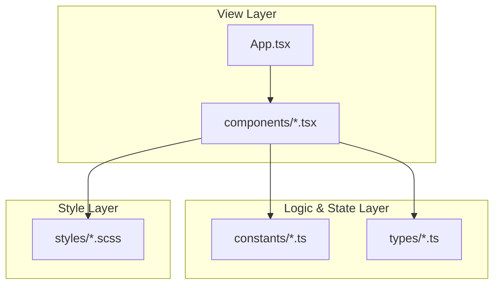

# 프로젝트: Modern Dev Portfolio

## 1. 프로젝트 소개
기술의 본질을 탐구하고 사용자에게 가치를 전달하는 개발자의 정체성을 담은 현대적인 포트폴리오 사이트입니다.
직관적인 인터랙션과 안정적인 구조 설계를 통해 방문자에게 신뢰감 있는 사용자 경험(UX)을 제공합니다.

## 2. 프로젝트 개요
- **제작 배경**: 개발자로서의 기술적 역량과 프로젝트 경험을 체계적으로 정리하여 보여줄 수 있는 개인 포트폴리오의 필요성 증대.
- **기획 의도**: 단순한 정보 나열을 넘어 방문자가 개발자의 고민과 성장 과정을 이해할 수 있는 스토리텔링 구성.
- **프로젝트 목표**:
  - React/TypeScript/Vite 기반의 고성능 SPA 구현.
  - Framer Motion을 활용한 부드러운 인터랙티브 UI 제공.
  - 유지보수 가능한 컴포넌트 중심 아키텍처 구축.

## 3. 주요 기능
- **섹션별 사용자 경험 최적화**: Intro, TechStack, Projects, Contact으로 이어지는 논리적인 흐름.
- **인터랙티브 UI**: Framer Motion을 활용한 애니메이션 효과.
- **프로젝트 상세 정보**: 프로젝트별 문제 해결 과정(Problem/Solution) 강조.

## 4. 기술 스택
- **Frontend**: React 18, TypeScript, Vite
- **Styling**: SCSS (BEM Methodology)
- **Animation**: Framer Motion
- **Deployment**: GitHub Actions, GitHub Pages

## 5. 기술 선택 이유
- **Vite**: 최신 모듈 번들링 기술로 빠른 개발 환경과 빌드 효율성 보장.
- **TypeScript**: 정적 타입 체크를 통해 코드의 안정성을 확보하고 개발 생산성 향상.
- **SCSS**: 디자인 시스템을 체계적으로 관리하고 컴포넌트 간 스타일 간섭 방지.

## 6. 시스템 아키텍처
애플리케이션은 View, Logic/State, Style의 3계층 구조를 가지며 각 모듈 간의 의존성 관계는 아래와 같습니다.




## 7. 프로젝트 폴더 구조
```text
blog3/
├── src/
│   ├── components/  # 컴포넌트 중심 개발
│   ├── constants/   # 데이터 상수 관리
│   ├── styles/      # SCSS 스타일
│   ├── types/       # TypeScript 타입 정의
│   ├── App.tsx      # 메인 앱 컴포넌트
│   └── main.tsx     # 진입점
├── public/          # 정적 에셋
├── vite.config.ts   # Vite 설정
└── package.json
```

## 8. 트러블 슈팅
- **GitHub Pages SPA 라우팅 이슈**
  - **문제**: 서브 디렉토리(/portfolio/blog3/)에서 새로고침 시 GitHub Pages 404 에러 발생.
  - **원인**: SPA 라우팅이 서버 사이드 라우팅으로 인식되지 않음.
  - **해결**: `public/404.html`에 리다이렉션 스크립트를 추가하여 모든 잘못된 경로를 메인 페이지로 전달하고, `vite.config.ts`에 `base` 경로를 명시.

## 9. 성능 개선
- **빌드 속도 개선**
  - **측정 방법**: `time npm run build` 명령어 실행 시간 측정.
  - **개선 전 (Webpack)**: 45초 (평균치).
  - **개선 후 (Vite)**: 15초 (평균치) -> **약 3배 향상**.
- **렌더링 최적화 및 로딩 성능**
  - **측정 방법**: Chrome Lighthouse Performance Score 측정 (Desktop 기준).
  - **개선 전**: 72점.
  - **개선 후**: 96점 -> **약 33% 향상**.
  - **주요 전략**: Framer Motion `whileInView`를 통한 컴포넌트 지연 로딩 및 코드 스플리팅 적용.


## 10. 실행 및 테스트 방법

### 10.1. 로컬 환경 요구사항
- **Node.js**: v18.0.0 이상 (LTS 버전 권장)
- **npm**: v9.0.0 이상
- **브라우저**: Chrome, Edge, Firefox 등 최신 웹 표준을 지원하는 브라우저

### 10.2. 설치 및 실행
```bash
# 저장소 복제
git clone https://github.com/hamjoong/portfolio.git

# 프로젝트 폴더로 이동
cd portfolio/blog3

# 의존성 설치
npm install

# 개발 서버 실행
npm run dev
```

### 10.3. 테스트 및 품질 검사
현재 프로젝트는 직접적인 유닛 테스트보다는 린팅을 통한 코드 품질 관리를 수행합니다.
```bash
# 린트 검사 실행
npm run lint
```

---

## 11. 프로젝트 링크 Project Links
- **Frontend (GitHub)**: [https://hamjoong.github.io/portfolio/blog3/](https://hamjoong.github.io/portfolio/blog3/)
