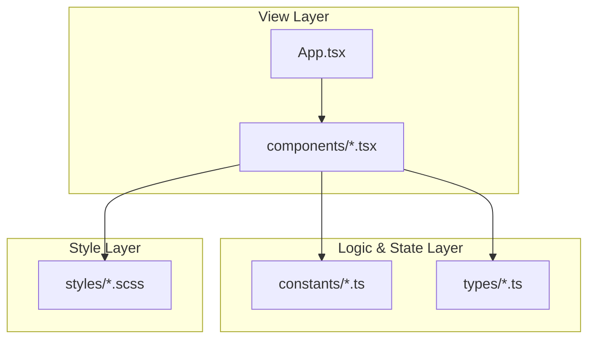

# 프로젝트: Developer Portfolio Blog

## 1. 프로젝트 소개
기술의 본질을 탐구하고 사용자에게 가치를 전달하는 개발자의 정체성을 담은 현대적인 포트폴리오 사이트입니다
직관적인 인터랙션과 안정적인 구조 설계를 통해 방문자에게 신뢰감 있는 사용자 경험(UX)을 제공합니다

## 2. 프로젝트 개요
- **제작 배경**: 개발자로서의 기술적 역량과 프로젝트 경험을 체계적으로 정리하여 보여줄 수 있는 개인 포트폴리오의 필요성 증대
- **기획 의도**: 단순한 정보 나열을 넘어 방문자가 개발자의 고민과 성장 과정을 이해할 수 있는 스토리텔링 구성
- **프로젝트 목표**:
  - React/TypeScript/Vite 기반의 고성능 SPA 구현
  - Framer Motion을 활용한 부드러운 인터랙티브 UI 제공
  - 유지보수 가능한 컴포넌트 중심 아키텍처 구축

## 3. 주요 기능
- **섹션별 사용자 경험 최적화**: Intro, TechStack, Projects, Contact으로 이어지는 논리적인 흐름
- **인터랙티브 UI**: Framer Motion을 활용한 애니메이션 효과
- **프로젝트 상세 정보**: 프로젝트별 문제 해결 과정(Problem/Solution) 강조

## 4. 기술 스택
- **Frontend**: React 18, TypeScript, Vite
- **Styling**: SCSS (섹션별 파일 분리, `&-` 중첩으로 `블록-요소` 형태 클래스 네이밍)
- **Animation**: Framer Motion
- **Icons**: lucide-react
- **Deployment**: GitHub Actions, GitHub Pages (https://hamjoong.github.io/portfolio/blog3/)

## 5. 기술 선택 이유
- **Vite**: 최신 모듈 번들링 기술로 빠른 개발 환경과 빌드 효율성 보장
- **TypeScript**: 정적 타입 체크를 통해 코드의 안정성을 확보하고 개발 생산성 향상
- **SCSS**: 색상·글꼴 변수를 `index.scss` 한 곳에서 관리하고, 섹션별 파일로 나눠 스타일 간섭 방지

## 6. 시스템 아키텍처
애플리케이션은 View, Logic/State, Style의 3계층 구조를 가지며 각 모듈 간의 의존성 관계는 아래와 같습니다


```mermaid
graph TD
    subgraph ViewLayer [View Layer]
        App[App.tsx]
        Components[components/*.tsx]
    end

    subgraph LogicLayer [Logic & State Layer]
        Constants[constants/*.ts]
        Types[types/*.ts]
    end

    subgraph StyleLayer [Style Layer]
        Styles[styles/*.scss]
    end

    App --> Components
    Components --> Constants
    Components --> Types
    Components --> Styles
```


## 7. 프로젝트 폴더 구조
```text
blog3/
├── src/
│   ├── components/  # 컴포넌트 중심 개발
│   ├── constants/   # 데이터 상수 관리
│   ├── lib/         # LazyMotion 지연 로드 기능 묶음
│   ├── styles/      # SCSS 스타일
│   ├── types/       # TypeScript 타입 정의
│   ├── App.tsx      # 메인 앱 컴포넌트
│   └── main.tsx     # 진입점
├── vite.config.ts   # Vite 설정
└── package.json
```

## 8. 트러블 슈팅
- **GitHub Pages 서브 디렉토리 배포 경로 이슈**
  - **문제**: 서브 디렉토리(/portfolio/blog3/)에 배포하면 JS/CSS 등 정적 에셋이 루트(`/assets/...`)로 요청되어 404 발생.
  - **원인**: Vite의 기본 `base`가 `/`라서 에셋 경로가 저장소 하위 경로를 반영하지 못함.
  - **해결**: `vite.config.ts`에 `base: '/portfolio/blog3/'`를 명시. 이 앱은 라우터 없이 해시 앵커(`#intro` 등)로 이동하는 단일 페이지라서 별도의 클라이언트 라우팅 처리는 필요하지 않음.

- **모바일 헤더 넘침**
  - **문제**: 320~375px 폭에서 로고와 메뉴 링크 4개가 한 줄을 넘어 가로 스크롤이 생김. 768px 미디어쿼리는 `ul`의 글자 크기만 바꿔서 실제 링크(`a`)에는 적용되지 않았음
  - **해결**: 글자 크기를 `a`에 직접 지정하고, 480px 이하에서는 링크 목록만 가로 스크롤되게 해 페이지 전체가 넘치지 않도록 함

## 9. 실행 및 테스트 방법

### 9.1. 로컬 환경 요구사항
- **Node.js**: v20 이상 (배포 워크플로와 같은 버전)
- **npm**: v9.0.0 이상
- **브라우저**: Chrome, Edge, Firefox 등 최신 웹 표준을 지원하는 브라우저

### 9.2. 설치 및 실행
```bash
# 저장소 복제
git clone https://github.com/hamjoong/portfolio.git

# 프로젝트 폴더로 이동
cd portfolio/blog3

# 의존성 설치
npm install

# 개발 서버 실행
npm run dev
```

### 9.3. 테스트 및 품질 검사
현재 프로젝트는 직접적인 유닛 테스트보다는 린팅(ESLint flat config: `eslint.config.js`)과 타입 검사를 통한 코드 품질 관리를 수행합니다.
```bash
# 린트 검사 실행
npm run lint

# 타입 검사 + 프로덕션 빌드
npm run build
```

---

## 10. 프로젝트 링크 Project Links
- **사이트 (GitHub Pages)**: [https://hamjoong.github.io/portfolio/blog3/](https://hamjoong.github.io/portfolio/blog3/)
- **소개하는 프로젝트**: [devcodehub](../devcodehub/) · [shoppingmall](../shoppingmall/) · [milktycoon](../milktycoon/)
