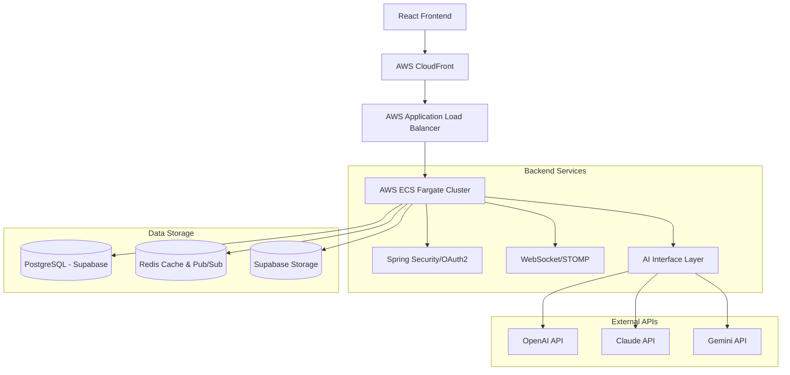

# 프로젝트 : DevCodeHub

# 프로젝트 개요 : 
"DevCodeHub" **취준생 & 주니어 개발자를 위한 실전 코드 피드백 + 커뮤니티 플랫폼**<br>
DevCodeHub는 AI 병렬 분석과 현업 시니어 개발자의 매칭을 통해 개발자의 실질적인 성장을 돕는 **컨텍스트 엔지니어링 기반의 코드 리뷰 플랫폼**입니다.<br>
- **목표**: AI 피드백과 시니어-주니어 간의 기술 교류를 통한 개발 선순환 생태계 구축
- **핵심 가치**: 전문성(Expertise), 신속성(Speed), 보안(Security)
- **주요 기능**:
  - **AI 코드 리뷰**: Gemini, Claude, OpenAI 모델을 활용한 다각도 코드 분석
  - **시니어 매칭 리뷰**: 현업 전문가와의 1:1 하이브리드 리뷰 시스템
  - **실시간 소통**: STOMP 기반의 실시간 채팅 및 알림 센터
  - **게이미피케이션**: 활동 기반 레벨링, 뱃지 획득 및 성장 그래프
  - **수익화 모델**: 크레딧 시스템 및 프리미엄 구독 플랜

---

# 스킬 스택 :

## Backend
- **Framework**: Spring Boot 3.4.1 (Java 21)
- **Database**: PostgreSQL (Supabase), Redis
- **Security**: Spring Security, OAuth 2.0, JWT
- **Communication**: STOMP (WebSocket), RestClient (Java 21)

## Frontend
- **Library**: React 19, TypeScript
- **Styling**: Tailwind CSS
- **State**: Zustand
- **Query**: TanStack Query v5
- **Editor**: Monaco Editor

## Infra & DevOps
- **Cloud**: AWS (ECS Fargate, S3, CloudFront, ECR, SSM)
- **CI/CD**: GitHub Actions
- **Container**: Docker (Multi-stage build)

---

# 아키텍쳐 :



---

# 프로젝트 구조 :

```text
devcodehub/
├── backend/
│   ├── src/main/java/com/hjuk/devcodehub/
│   │   ├── domain/        # 비즈니스 로직 (board, chat, notification, review, user)
│   │   ├── global/        # 공통 설정 (config, error, logging, security, util)
│   │   └── DevCodeHubApplication.java
│   └── .env.production    # 운영 환경 변수 로드
├── frontend/
│   ├── src/
│   │   ├── components/    # 재사용 컴포넌트
│   │   ├── pages/         # 페이지별 컴포넌트
│   │   ├── services/      # API 및 소켓 서비스
│   │   └── store/         # Zustand 상태 관리
│   └── .env.production
└── docs/                  # 설계 문서 및 운영 가이드
```

---

# 핵심 트러블 슈팅 :

## 1. 운영 환경 이전 시 주요 에러 분석
운영 환경(AWS)으로 이전하면서 발생한 다양한 이슈 해결 사례입니다. <br>

- 문제: 인증 및 리다이렉트 이슈 <br>
원인: 소셜 로그인 후 리다이렉트 시 발생하는 인증 에러는 리다이렉트 URI 설정 불일치 와 CloudFront-ALB 간 Authorization 헤더 유실 이 주요 원인이었습니다. <br>
해결: 각 소셜 콘솔(Google 등)에 CloudFront 도메인을 포함한 URI를 명시적으로 등록하여 해결했습니다. <br> <br>
원인: 정적 리소스 및 SPA 라우팅 새로고침 시 발생하는 404 에러 <br>
해결: S3 정적 호스팅 설정에서 `Index` 및 `Error document`를 모두 `index.html`로 설정하여 해결하였습니다. <br> <br>
원인: AI 모델 호출 오류 운영 환경의 네트워크 환경 차이로 인한 타임아웃 문제 <br>
해결: 타임아웃 문제를 해결하기 위해 `aiTaskExecutor`의 스레드 풀 설정을 튜닝하고 60초 타임아웃을 적용하였습니다. <br>

## 2. 스토리지 업로드 문제
- 문제: 이미지 업로드 시 `SignatureDoesNotMatch` 오류. <br>
원인: Java AWS SDK v1의 페이로드 서명(리전 및 엔드포인트) 방식과 Supabase의 S3 게이트웨이 간 호환성 문제. <br>
해결: AWS SDK 사용을 중단하고 **Supabase Native Storage API**를 `service_role` JWT와 함께 직접 호출하는 방식으로 완전히 재설계했습니다. <br>

---

# 성능 개선 수치 :
- 응답 속도: p95 Latency 200ms 이하 유지 (Redis 캐싱 및 N+1 쿼리 최적화)
- 보안 표준: `MaskingUtil`을 통한 로그 내 개인정보(PII) 자동 마스킹 및 Zero Trust 아키텍처 준수
- 코드 품질: Checkstyle 9.3 표준 준수 및 테스트 커버리지 확보

---

# 실행 방법 :

## Prerequisites
- JDK 21+, Node.js 22+, Docker

## Backend
```bash
cd devcodehub/backend
# .env 파일 생성 및 SSM 환경변수 설정 확인
mvn clean package
java -jar -Dspring.profiles.active=local target/devcodehub-0.0.1-SNAPSHOT.jar
```

## Frontend
```bash
cd devcodehub/frontend
npm install
npm run dev
```

---