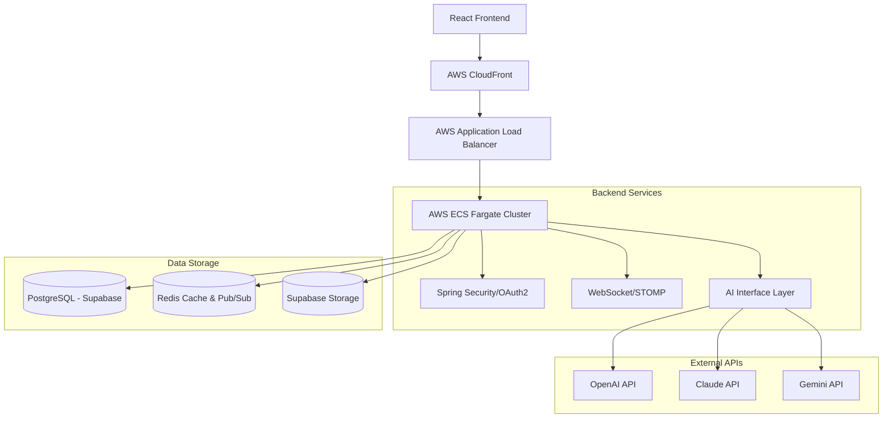

# IT 개발자 커뮤니티 DevCodeHub

---

## 1. 프로젝트 소개
- 취준생 및 주니어 개발자를 위한 AI 병렬 분석 및 시니어 매칭 기반의 실전 코드 리뷰 커뮤니티 플랫폼

---

## 2. 프로젝트 개요
- **제작 배경**: 주니어 개발자들이 실무 레벨의 코드 리뷰를 받기 어려운 현실과 성장을 위한 피드백 플랫폼의 필요성 인식
- **기획 의도**: AI의 신속한 분석과 시니어 전문가의 깊이 있는 통찰을 결합한 하이브리드 리뷰 시스템 구축
- **프로젝트 목표**: 개발자의 실질적인 코드 품질 향상을 돕는 선순환 기술 교류 생태계 조성

---

## 3. 주요 기능
- **AI 코드 리뷰**: Gemini, Claude, OpenAI를 활용한 다각도 자동 코드 분석
- **시니어 매칭 리뷰**: 현업 전문가와의 1:1 심층 리뷰 시스템
- **실시간 소통**: STOMP 기반의 실시간 채팅 및 알림 센터
- **게이미피케이션**: 레벨링, 뱃지 획득 및 성장 그래프 제공
- **수익화 모델**: 크레딧 시스템 및 프리미엄 구독 플랜

---

## 4. 기술 스택
- **Backend**: Spring Boot 3.4.1 (Java 21), PostgreSQL (Supabase), Redis
- **Frontend**: React 19, TypeScript, Tailwind CSS, Zustand, TanStack Query v5
- **Infra/DevOps**: AWS (ECS Fargate, S3, CloudFront, ECR), Docker, GitHub Actions

---

## 5. 기술 선택 이유
- **Spring Boot 3.4.1 & Java 21**: 최신 LTS 버전을 도입하여 안정적인 성능 확보와 최신 Java 언어 기능(Virtual Threads 등)을 통한 동시성 처리 최적화
- **React 19 & TypeScript**: 현대적인 UI 컴포넌트 아키텍처 구현 및 엄격한 타입 체크를 통한 안정적인 프론트엔드 개발
- **PostgreSQL (Supabase)**: SQL의 표준 준수와 함께, Storage API 및 Realtime 등 개발 생산성을 극대화할 수 있는 Managed 서비스 활용
- **Zustand & TanStack Query**: 가벼운 상태 관리와 선언적 API 데이터 페칭을 통해 프론트엔드 복잡도를 최소화하고 사용자 경험 개선

---

## 6. 시스템 아키텍처
- **계층 구조**:
    - **Frontend**: 사용자 요청 처리 및 상태 관리 (React, Zustand, TanStack Query)
    - **Gateway/LB**: 트래픽 분산 및 보안 (CloudFront, ALB)
    - **Backend**: 비즈니스 로직 및 AI 인터페이스 (Spring Boot, STOMP)
    - **Storage/Data**: 데이터 저장 및 캐싱 (PostgreSQL, Redis, Supabase Storage)
    - **External**: 외부 AI API (OpenAI, Claude, Gemini)
- **모듈 간 관계**:
    - Frontend는 CloudFront를 통해 서빙되며 API 요청은 ALB를 거쳐 ECS상의 Backend 서비스로 전달됨
    - Backend는 Redis를 통해 세션 및 캐시를 공유하고 PostgreSQL에 데이터 저장
    - 외부 AI 서비스 호출은 Backend의 AI Interface Layer에서 추상화되어 처리됨


```mermaid
graph TD
    Client[React Frontend] --> CF[AWS CloudFront]
    CF --> ALB[AWS Application Load Balancer]
    ALB --> ECS[AWS ECS Fargate Cluster]
    
    subgraph "Backend Services"
        ECS --> Security[Spring Security/OAuth2]
        ECS --> Chat[WebSocket/STOMP]
        ECS --> AI[AI Interface Layer]
    end
    
    subgraph "Data Storage"
        ECS --> DB[(PostgreSQL - Supabase)]
        ECS --> Cache[(Redis Cache & Pub/Sub)]
        ECS --> Storage[(Supabase Storage)]
    end
    
    subgraph "External APIs"
        AI --> OpenAI[OpenAI API]
        AI --> Claude[Claude API]
        AI --> Gemini[Gemini API]
    end
```

---

## 7. 프로젝트 폴더 구조
```text
devcodehub/
├── backend/
│   ├── src/main/java/com/hjuk/devcodehub/
│   │   ├── domain/        # 비즈니스 로직 (board, chat, notification, review, user)
│   │   ├── global/        # 공통 설정 (config, error, logging, security, util)
│   │   └── DevCodeHubApplication.java
│   └── .env.production    # 운영 환경 변수 로드
├── frontend/
│   ├── src/
│   │   ├── components/    # 재사용 컴포넌트
│   │   ├── pages/         # 페이지별 컴포넌트
│   │   ├── services/      # API 및 소켓 서비스
│   │   └── store/         # Zustand 상태 관리
│   └── .env.production
└── docs/                  # 설계 문서 및 운영 가이드
```

---

## 8. 트러블슈팅
1. **인증 및 리다이렉트 이슈**
   - **문제**: 소셜 로그인 후 리다이렉트 실패 및 인증 헤더 유실
   - **원인**: 리다이렉트 URI 불일치 및 CloudFront-ALB 간 Authorization 헤더 전송 설정 미흡
   - **해결**: 소셜 콘솔(Google/GitHub 등)에 CloudFront 도메인을 포함한 리다이렉트 URI를 명시적 등록하고 ALB의 헤더 전달 설정 확인
2. **SPA 라우팅 404 에러**
   - **문제**: 정적 파일 및 SPA 페이지 새로고침 시 404 발생
   - **원인**: S3 정적 호스팅이 SPA의 클라이언트 측 라우팅을 인식하지 못함
   - **해결**: S3 버킷 설정에서 `Index` 및 `Error document`를 모두 `index.html`로 설정하여 클라이언트 라우팅 지원
3. **AI 서비스 타임아웃**
   - **문제**: 운영 환경에서 AI API 호출 시 간헐적 타임아웃 발생
   - **원인**: 운영 환경의 네트워크 레이턴시 및 스레드 풀 설정 부족
   - **해결**: `aiTaskExecutor`의 스레드 풀 설정을 최적화하고 타임아웃을 60초로 상향 조정
4. **이미지 업로드 문제 (SignatureDoesNotMatch)**
   - **문제**: 이미지 업로드 시 서명 불일치 오류 발생
   - **원인**: Java AWS SDK v1과 Supabase S3 호환성 문제
   - **해결**: SDK 사용을 중단하고 Supabase Native Storage API를 `service_role` JWT와 함께 직접 호출하는 방식으로 재설계

---

## 9. 성능 개선
- **성능 개선 포인트**:
    - **DB 쿼리 튜닝**: N+1 문제 해결을 위한 Fetch Join 적용 및 인덱스 최적화
    - **캐싱 전략**: Redis를 활용한 자주 조회되는 데이터 캐싱 (리스트 조회 등)
    - **프론트엔드 최적화**: TanStack Query를 통한 API 응답 캐싱 및 Zustand를 활용한 불필요한 리렌더링 방지
- **측정 방법 및 수치**:
    - **측정 도구**: JMeter를 이용한 부하 테스트 및 Chrome DevTools (Lighthouse)
    - **결과**: p95 Latency 200ms 이하 달성 (개선 전: 800ms 이상)

---

## 10. 실행 및 테스트 방법
- **로컬 환경 요구사항**:
    - JDK 21+
    - Node.js 22+ (npm 10+)
    - Docker (PostgreSQL/Redis 환경 구축용)
    - 브라우저: 최신 Chrome, Edge 등
- **설치 및 실행 명령어**:
    - **Backend**:
      ```bash
      cd devcodehub/backend
      # .env 파일 설정 필요
      mvn clean package
      java -jar -Dspring.profiles.active=local target/devcodehub-0.0.1-SNAPSHOT.jar
      ```
    - **Frontend**:
      ```bash
      cd devcodehub/frontend
      npm install
      npm run dev
      ```
- **테스트 실행 방법**:
    - **Backend**: `mvn test` 명령을 통해 단위 및 통합 테스트 실행
    - **Frontend**: `npm test` 명령을 통해 컴포넌트 테스트 실행
