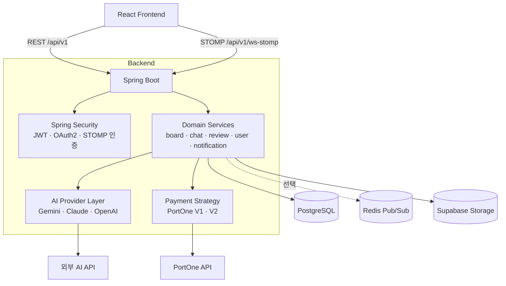

# IT 개발자 커뮤니티 DevCodeHub

> 취준생·주니어 개발자를 위한 **AI 병렬 코드 리뷰 + 시니어 매칭 리뷰** 커뮤니티 플랫폼

- **PortOne 결제는 테스트(가상) 결제**입니다. 실제 금액이 청구되지 않습니다.

---

## 1. 프로젝트 소개
- 주니어 개발자가 실무 수준의 코드 리뷰를 받기 어렵다는 문제에서 출발했습니다.
- AI의 빠른 1차 분석과 시니어 개발자의 깊이 있는 리뷰를 결합한 **하이브리드 리뷰**를 제공합니다.
- 리뷰·게시판·채팅 활동이 레벨·뱃지·활동 잔디로 쌓여 꾸준한 성장을 눈으로 확인할 수 있습니다.

---

## 2. 주요 기능

| 기능 | 설명 |
| --- | --- |
| AI 코드 리뷰 | Gemini · Claude · OpenAI 3종을 한 번에 병렬 호출해 결과를 비교합니다. API 키가 등록된 모델만 선택할 수 있고, 미등록 모델은 화면에서 "키 미등록"으로 비활성화됩니다. |
| 시니어 매칭 리뷰 | 주니어가 크레딧을 걸어 요청하면 인증된 시니어가 지원 → 주니어가 수락 → 리뷰 작성 → 수수료(10%) 정산 순으로 진행됩니다. |
| 게시판 | SKILL / AI 분류, 태그·키워드 검색, 좋아요·북마크·댓글, 조회수 |
| 실시간 채팅·알림 | STOMP(WebSocket) 1:1·그룹 채팅, 안 읽은 메시지 수, 실시간 알림 |
| 활동 잔디 | GitHub 잔디처럼 최근 1년간 글·댓글·AI 리뷰·시니어 리뷰 활동량을 날짜별로 표시 |
| 게이미피케이션 | 경험치·레벨, 활동 기반 뱃지(첫 글, 댓글 N회, AI 리뷰 N회, 누적 XP), 랭킹 |
| 크레딧·구독 | PortOne 테스트 결제로 크레딧 충전, 주간/월간/연간 구독(주간 AI 무료 한도 증가) |
| 관리자 | 통계 대시보드, 회원·콘텐츠 관리, 시니어 인증 심사, 크레딧 조정, 감사 로그 |

> **AI 3종 상태**: Claude·OpenAI 연동 코드는 구현되어 있지만, 비용 문제로 데모 환경에는 **Gemini 키만 등록**했습니다. 키를 환경변수(`CLAUDE_API_KEY`, `OPENAI_API_KEY`)에 넣으면 코드 수정 없이 활성화됩니다.

---

## 3. 기술 스택
- **Backend**: Spring Boot 3.4.1 (Java 21), Spring Security(JWT + OAuth2), JPA, PostgreSQL(Supabase), STOMP/SockJS, Redis(선택)
- **Frontend**: React 19, TypeScript, Vite, Tailwind CSS 3, Zustand, TanStack Query v5, Monaco Editor(CDN), Chart.js
- **외부 연동**: Gemini / Claude / OpenAI API, PortOne(V2 SDK + V1·V2 서버 검증), Supabase Storage
- **로컬 인프라**: Docker Compose (PostgreSQL 16, Redis 7)

---

## 4. 시스템 구조


```mermaid
graph TD
    Client[React Frontend] -->|REST /api/v1| API[Spring Boot]
    Client -->|STOMP /api/v1/ws-stomp| API

    subgraph "Backend"
        API --> Security[Spring Security<br/>JWT · OAuth2 · STOMP 인증]
        API --> Services[Domain Services<br/>board · chat · review · user · notification]
        Services --> AI[AI Provider Layer<br/>Gemini · Claude · OpenAI]
        Services --> Pay[Payment Strategy<br/>PortOne V1 · V2]
    end

    Services --> DB[(PostgreSQL)]
    Services -. 선택 .-> Redis[(Redis Pub/Sub)]
    Services --> Storage[(Supabase Storage)]
    AI --> Ext[외부 AI API]
    Pay --> PortOne[PortOne API]
```

- **인증**: 서버에 세션을 두지 않는 **stateless JWT**입니다. 소셜 로그인(Google·GitHub·Kakao·Naver) 성공 후 JWT는 URL fragment(`#token=`)로 프론트에 전달됩니다.
- **Redis는 선택 사항**입니다. 켜면(`REDIS_AUTO_STARTUP=true`) 채팅 메시지를 여러 서버 인스턴스에 전달하는 Pub/Sub으로만 쓰이고, 꺼도 단일 서버로 모든 기능이 동작합니다. 채팅 메시지는 DB에 즉시 저장됩니다.
- **결제**: 프론트는 PortOne V2 SDK로 결제하고, 서버가 PortOne API로 결제를 다시 조회해 검증합니다. 서버는 `imp_` 접두사 결제는 V1, 나머지는 V2 방식으로 조회합니다.

---

## 5. 보안·정합성 설계 요약
- 관리자 API는 URL 규칙(`/api/v1/admin/**`)과 메서드 보안(`@PreAuthorize`)을 함께 적용하고, 비로그인 공개 GET은 화이트리스트로만 허용합니다.
- **STOMP 인증**: CONNECT 시 JWT를 검증하고, 채팅방은 참여자만·알림 채널은 본인만 구독할 수 있습니다. 메시지 발신자는 클라이언트 값이 아니라 인증 정보에서 가져옵니다.
- **결제 검증**: 결제 ID는 한 번만 사용할 수 있고(DB 유니크), 금액은 서버 가격표와 비교하며, 결제 시 심어 둔 사용자 식별값이 요청자와 일치해야 합니다. 구독 해지 환급은 실제 결제 금액을 기준으로 남은 기간만큼 계산합니다.
- **크레딧 동시성**: 크레딧 증감과 시니어 정산은 행 잠금으로 직렬화해 중복 정산·이중 차감을 막습니다.
- 업로드는 이미지 형식(jpg/png/webp/gif)·크기(5MB)·파일 서명을 검사하고 서버가 파일명을 새로 만듭니다.
- 에러 응답에는 내부 예외 메시지·SQL 정보를 싣지 않고, API 키는 URL이 아니라 헤더로 전달합니다. 로그의 개인정보는 마스킹합니다.
- 로그인·회원가입은 IP당 분당 10회, 일반 API는 IP당 초당 약 50회로 제한합니다.
- 비밀번호 찾기는 이메일 발송 수단이 없어 **관리자 문의**로 안내합니다(임시 비밀번호를 화면에 내주지 않습니다).

자세한 내용은 [`docs/SECURITY.md`](docs/SECURITY.md)를 참고하세요.

---

## 6. 성능 관련 적용 사항
측정한 수치는 아직 없으며, 아래는 코드에 실제로 적용된 개선입니다.
- 목록 조회 N+1 제거: `@EntityGraph`, `default_batch_fetch_size`, 집계 쿼리(시니어 지원자 수), 전체 로드 대신 조건 쿼리
- 만료 알림·채팅 삭제는 행을 읽지 않는 벌크 DELETE
- `open-in-view: false`로 화면 렌더링 동안 DB 커넥션을 잡지 않음
- AI 호출은 **트랜잭션 밖**에서 병렬로 수행하고(전용 스레드 풀, 90초 상한), 성공한 건수만큼만 짧은 트랜잭션으로 정산
- 외부 API 호출 타임아웃: 연결 5초 · 읽기 60초
- 조회수·크레딧 변경은 DB에서 원자적으로 처리
- 프론트: 라우트 단위 코드 분할(lazy), 스토어 selector 구독으로 불필요한 리렌더링 방지

---

## 7. 프로젝트 폴더 구조
```text
devcodehub/
├── backend/
│   ├── src/main/java/com/hjuk/devcodehub/
│   │   ├── domain/        # board, chat, notification, review, user
│   │   └── global/        # config, error, logging, security, util
│   ├── db/                # 운영 DB 수동 적용 SQL (ddl-auto: none 이므로)
│   ├── .env.example       # 환경변수 목록(값 없음)
│   └── Dockerfile
├── frontend/
│   └── src/
│       ├── components/    # 재사용 컴포넌트
│       ├── pages/         # 페이지
│       ├── services/      # API·STOMP 클라이언트
│       └── store/         # Zustand 스토어
├── infra/                 # 로컬 개발용 docker-compose (PostgreSQL, Redis)
└── docs/                  # PRD · TRD · API · Architecture · Security · ADR
```

---

## 8. 실행 방법 (로컬)

**요구사항**: JDK 21, Node.js 22+, Docker

1. **DB 실행**
   ```bash
   cd infra
   cp .env.example .env      # POSTGRES_PASSWORD 설정
   docker compose up -d
   ```
2. **Backend** — `backend/.env.example`을 `backend/.env`로 복사해 값을 채웁니다(필수: DB, `JWT_SECRET`, `ADMIN_ID`, `ADMIN_PASSWORD`, 소셜 로그인 키). 기본 프로필은 `local`이며 스키마가 자동 생성됩니다.
   ```bash
   cd backend
   mvn spring-boot:run
   ```
3. **Frontend**
   ```bash
   cd frontend
   npm install
   npm run dev          # http://localhost:5173 (API는 8080으로 프록시)
   ```
   결제를 시험하려면 `frontend/.env`에 `VITE_PORTONE_STORE_ID`, `VITE_PORTONE_CHANNEL_KEY`를 설정합니다.

**운영(prod 프로필)** 은 `ddl-auto: none`입니다. 스키마 변경은 `backend/db/*.sql`을 먼저 적용해야 하고, 공개 주소는 `BACKEND_URL`·`FRONTEND_URL` 환경변수로 지정합니다.

---

## 9. 테스트·검증
- **Backend**: `mvn test` — 단위 테스트(서비스·보안 규칙·결제 검증 등)와 Checkstyle이 함께 실행됩니다.
- **Frontend**: 자동화 테스트는 아직 없습니다. `npm run lint`(ESLint)와 `npm run build`(타입 검사 + 빌드)로 검증합니다.

---

## 10. 트러블슈팅 기록
1. **소셜 로그인 리다이렉트 실패**
   - 원인: 소셜 콘솔에 등록한 redirect URI와 서버 설정이 불일치, 프록시 뒤에서 Authorization 헤더 유실
   - 해결: redirect URI를 `BACKEND_URL` 환경변수에서 만들도록 하고 소셜 콘솔에 같은 주소를 등록. 프록시 뒤에서는 `forward-headers-strategy: framework`로 실제 클라이언트 IP·프로토콜 인식
2. **SPA 새로고침 404**
   - 원인: 정적 호스팅이 클라이언트 라우팅 경로를 모름
   - 해결: 호스팅 쪽에서 모든 경로를 `index.html`로 폴백하도록 설정
3. **AI 호출 지연으로 DB 커넥션 고갈 위험**
   - 원인: AI 응답을 기다리는 동안 트랜잭션이 커넥션을 계속 점유
   - 해결: AI 호출을 트랜잭션 밖으로 분리하고 성공 건수만 짧은 트랜잭션으로 정산, 호출·읽기 타임아웃 설정
4. **이미지 업로드 `SignatureDoesNotMatch`**
   - 원인: Java AWS SDK v1과 Supabase S3 호환 API의 서명 방식 불일치
   - 해결: SDK를 쓰지 않고 Supabase Native Storage API를 `service_role` 키로 직접 호출
5. **모바일 결제 후 크레딧이 지급되지 않을 수 있던 문제**
   - 원인: 모바일(REDIRECTION)은 결제 후 주소 쿼리로 돌아오는데 V2 파라미터(`paymentId`)를 읽지 않음
   - 해결: V2(`paymentId`·`code`)와 V1(`imp_uid`) 파라미터를 모두 받아 서버 검증으로 전달 *(실기기 결제 확인 필요)*

---

## 11. 알려진 한계
- Claude·OpenAI는 키가 있어야 동작합니다(데모에서는 Gemini만 사용).
- 프론트 자동화 테스트가 없고, 부하 테스트 수치는 측정하지 않았습니다.
