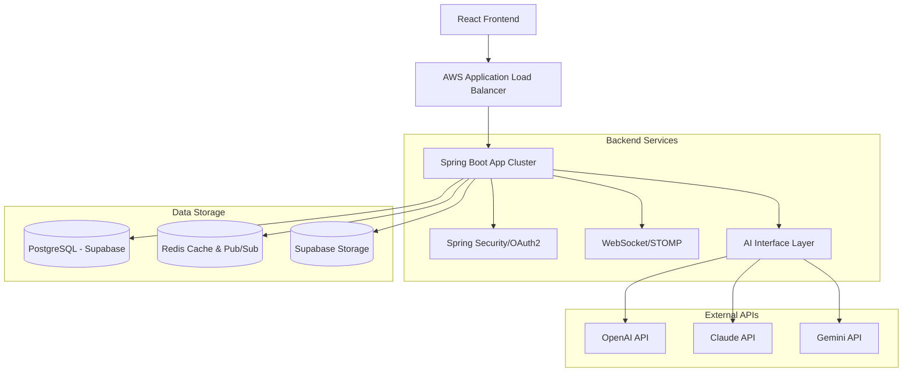

# [Architecture] DevCodeHub - 시스템 아키텍처 설계

## 1. 전체 시스템 구성도 (System Overview)

## 2. 레이어드 아키텍처 (Layered Architecture)

우리 시스템은 **계층형 구조(Layered Architecture)**를 따르며, 각 레이어는 자신의 책임에만 집중합니다.

- **Presentation Layer (Web/Controller)**: HTTP 요청 처리, JSON 변환, API 명세(Swagger)
- **Service Layer (Business)**: 핵심 비즈니스 로직, 트랜잭션 관리, AI 서비스 호출
- **Infrastructure Layer (Data/External)**: DB 접근(JPA), 외부 API 통신(OpenAI 등), Redis 캐싱
- **Common/Shared Layer**: 전역 예외 처리, 공통 유틸리티, 상수 정의

## 3. 데이터 흐름 (Data Flow)

### 3.1 AI 코드 리뷰 흐름
1. 사용자가 Monaco Editor에서 코드를 작성하고 리뷰 요청 (OpenAI, Claude, Gemini 중 다중 선택 가능)
2. API 서버가 요청을 받고, CompletableFuture를 통해 선택된 각 AI 모델로부터 병렬로 리뷰 수신
3. 각 AI 모델에 맞는 프롬프트(20년차 시니어 개발자 페르소나) 구성 및 JSON 구조화 응답 강제
4. 수신된 구조화된 결과를 JSONB 포맷으로 DB에 개별 저장하고 사용자에게 통합 응답
5. 사용자의 성장 그래프(Activity Graph) 포인트 업데이트 및 리뷰 히스토리 관리

### 3.2 실시간 채팅 흐름
1. 사용자가 WebSocket 연결 시 STOMP 엔드포인트에 구독
2. 메시지 발송 시 Redis Pub/Sub을 통해 모든 서버 인스턴스에 전파
3. 해당 방을 구독 중인 사용자에게 실시간 메시지 전달
4. 백그라운드 스케줄러가 Redis의 채팅 로그를 5분 간격으로 DB에 일괄 저장 (Write-behind 전략)

## 4. 인프라 확장 및 배포 전략

### 4.1 무중단 배포 (Blue-Green Deployment)
- **AWS ECS/EC2** 환경에서 새 버전(Green)을 배포한 후 상태 확인(Health Check) 성공 시 로드밸런서의 타겟 그룹을 전환하여 다운타임을 제로(0)로 유지합니다.

### 4.2 데이터베이스 마이그레이션
- 개발 초기에는 로컬 H2를 사용하며, 배포 단계에서 **Supabase(PostgreSQL)**로 전환합니다.
- 스키마 변경 시 **Flyway** 또는 **Liquibase**를 사용하여 DB 버전 관리를 수행합니다.
