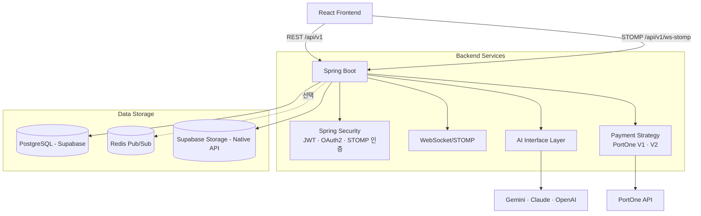

# [Architecture] DevCodeHub - 시스템 아키텍처 설계

## 1. 전체 시스템 구성도 (System Overview)

```mermaid
graph TD
    Client[React Frontend] -->|REST /api/v1| App[Spring Boot]
    Client -->|STOMP /api/v1/ws-stomp| App

    subgraph "Backend Services"
        App --> Security[Spring Security<br/>JWT · OAuth2 · STOMP 인증]
        App --> Chat[WebSocket/STOMP]
        App --> AI[AI Interface Layer]
        App --> Pay[Payment Strategy<br/>PortOne V1 · V2]
    end

    subgraph "Data Storage"
        App --> DB[(PostgreSQL - Supabase)]
        App -. 선택 .-> Cache[(Redis Pub/Sub)]
        App --> Storage[(Supabase Storage - Native API)]
    end

    AI --> Ext[Gemini · Claude · OpenAI]
    Pay --> PortOne[PortOne API]
```

호스팅(로드밸런서·CDN 등)은 이 문서의 범위 밖입니다. 애플리케이션은 공개 주소를 환경변수(`FRONTEND_URL`, `BACKEND_URL`)로만 받으므로 특정 호스팅에 묶이지 않습니다.

## 2. 레이어드 아키텍처 (Layered Architecture)

각 레이어는 자신의 책임에만 집중합니다.

- **Presentation Layer (Controller)**: HTTP 요청 처리, JSON 변환, 표준 응답(`ApiResponse`) 적용
- **Service Layer (Business)**: 핵심 비즈니스 로직, 트랜잭션 경계, AI 병렬 호출(`CompletableFuture`)
- **Infrastructure Layer (Data/External)**: DB 접근(JPA), 외부 API 통신(`RestClient`), Redis 메시징
- **Common/Shared Layer**: 전역 예외 처리(`GlobalExceptionHandler`), 보안 필터, 마스킹 유틸(`MaskingUtil`)

## 3. 데이터 흐름 (Data Flow)

### 3.1 AI 코드 리뷰 흐름
1. 사용자가 Monaco Editor에서 코드를 작성하고 모델(Gemini·Claude·OpenAI)을 골라 요청합니다. 화면은 `GET /reviews/ai/models`로 키가 등록된 모델만 활성화합니다.
2. 서버는 **AI 호출 전에** 요청 모델이 사용 가능한지, 무료 한도·크레딧이 충분한지 검사합니다(트랜잭션 없이 조회만).
3. `aiTaskExecutor` 스레드 풀로 모델별 호출을 병렬 실행합니다(호출당 90초 상한, HTTP 연결 5초·읽기 60초 타임아웃). 이 구간에는 DB 트랜잭션이 없습니다.
4. 프롬프트로 구조화된 JSON(summary, rating, pros, cons)을 요구하며, 결과는 이력 테이블에 JSON 텍스트로 저장합니다.
5. 성공한 건수만큼 `AiReviewBillingService`가 **짧은 트랜잭션**에서 무료 한도 → 크레딧 순으로 차감하고 경험치를 기록합니다. 사용자 행에 잠금을 걸어 동시 요청의 중복 사용을 막습니다.
6. 비회원은 IP 기준 누적 3회, 100줄 이하로 제한합니다.

### 3.2 실시간 채팅·알림 흐름
1. 로그인한 클라이언트는 앱 시작 시 `/api/v1/ws-stomp`에 JWT와 함께 연결합니다(싱글턴 클라이언트, 재연결 시 구독 자동 복구).
2. 서버의 인터셉터(`StompAuthChannelInterceptor`)가 CONNECT에서 JWT를 검증하고, SUBSCRIBE에서 채팅방 참여자·본인 채널 여부를 검사합니다.
3. 메시지 발송(`/pub/chat/message`) 시 서버가 발신자를 인증 정보에서 정해 DB에 **즉시 저장**하고, 같은 인스턴스의 구독자에게 브로드캐스트합니다. Redis를 켠 경우 다른 인스턴스로도 한 번만 발행합니다.
4. 안 읽은 메시지 수와 알림은 **트랜잭션 커밋 이후** 별도 스레드(`@TransactionalEventListener(AFTER_COMMIT)` + `@Async`)에서 계산·전송합니다. 알림 실패가 본 작업을 롤백시키지 않습니다.

### 3.3 결제 흐름 (PortOne 테스트 결제)
1. 프론트가 PortOne V2 SDK로 결제를 요청합니다. 결제 정보에 사용자 식별값(`customData.loginId`, `customer.customerId`)을 함께 보냅니다.
2. PC는 창(IFRAME)에서 결과가 바로 돌아오고, 모바일은 리다이렉트로 돌아와 `paymentId`(V2) 또는 `imp_uid`(V1) 쿼리를 읽습니다.
3. 프론트가 `POST /credits/validate` 또는 `/credits/subscribe/validate`를 호출하면, 서버가 PortOne API로 결제를 **다시 조회**합니다(캐시 없음).
4. 서버는 ① 결제 ID 미사용 ② 결제 완료(PAID) ③ 금액이 서버 가격표와 일치 ④ 결제 소유자가 요청자와 일치를 모두 확인한 뒤에만 크레딧/구독을 지급하고, 결제 ID를 유니크 컬럼에 기록합니다.

### 3.4 파일 업로드 흐름
1. 이미지 형식·크기·파일 서명을 검증하고 서버가 파일명을 새로 만듭니다.
2. local 프로필은 서버 디스크에, prod 프로필은 **Supabase Native Storage API**(`service_role` 키)로 업로드합니다. (과거 AWS SDK v1과의 서명 불일치 때문에 SDK를 쓰지 않습니다.)
3. 업로드된 URL은 프로필 저장 시 허용된 출처(자체 업로드 경로·Supabase·DiceBear)인지 검사한 뒤 저장합니다.

## 4. 운영 방식

### 4.1 배포
- 현재 배포 환경은 정해지지 않았습니다(호스팅 선정 중). 컨테이너 이미지는 `backend/Dockerfile`로 빌드하며 비밀값은 이미지에 넣지 않고 실행 시 환경변수로 주입합니다.
- 무중단(Blue-Green) 배포는 구성하지 않았습니다.

### 4.2 데이터베이스 변경
- local 프로필은 `ddl-auto: update`로 자동 반영됩니다.
- 운영(prod)은 `ddl-auto: none`이며 마이그레이션 도구(Flyway 등)는 도입하지 않았습니다. 스키마 변경은 `backend/db/*.sql`을 배포 전에 수동 적용합니다.
