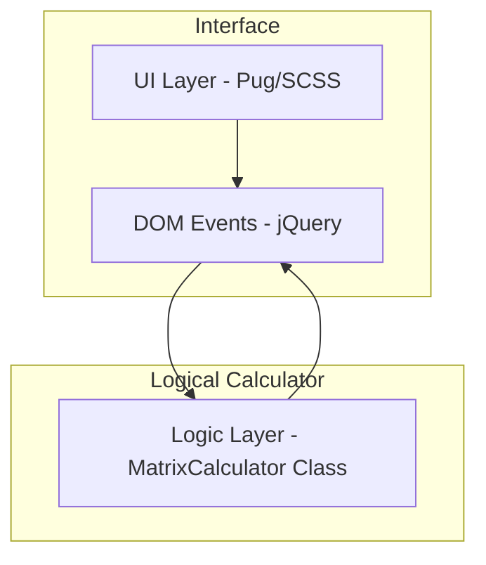

# 🧮 행렬 계산기 Matrix Calculator

---

## 1. 프로젝트 소개
웹 브라우저에서 수학적 행렬 연산을 쉽고 빠르게 수행하고 시각적으로 확인할 수 있는 대화형 웹 도구입니다.
행렬의 크기를 유동적으로 조절하고 연산 결과를 즉각적으로 확인하는 반응형 UI를 제공합니다.

---

## 2. 프로젝트 개요
* **제작 배경**: 복잡한 행렬 연산 과정을 직관적인 인터페이스로 단순화하여 수학적 학습 및 검증 효율을 높이고자 제작되었습니다.
* **기획 의도**: 사용자가 별도의 설치 과정 없이 웹 환경에서 행렬 데이터를 손쉽게 조작하고 연산 결과를 시각화하여 학습할 수 있는 환경을 구축합니다.
* **프로젝트 목표**: 
    * 반응형 Grid 기반의 행렬 시각화.
    * 실시간 연산 및 동적 DOM 조작 성능 최적화.
    * 유효성 검사를 통한 안정적인 연산 환경 제공.

---

## 3. 주요 기능
* **동적 행렬 크기 조절**: 행(Row)과 열(Column) 크기(1~9) 실시간 조절.
* **데이터 입력 모드**: 직접 입력 및 자동완성(1~99 랜덤 생성) 지원.
* **행렬 연산**: 덧셈, 뺄셈, 곱셈 지원 및 연산 규칙 검증.
* **반응형 시각화**: CSS Grid를 활용한 결과 격자 출력.

---

## 4. 기술 스택
| 기술 | 분류 | 비고 |
| :--- | :--- | :--- |
| **Pug** | Markup Template | 계층적 마크업 구조화 |
| **SCSS** | Style (Sass) | 믹스인 활용 스타일 모듈화 |
| **jQuery** | DOM Interaction | 효율적인 DOM 조작 및 이벤트 처리 |
| **JavaScript (ES6+)** | Business Logic | 클래스 기반 연산 로직 캡슐화 |

---

## 5. 기술 선택 이유
* **Pug/SCSS**: 마크업 중복 최소화 및 유지보수성 향상을 위해 사용.
* **jQuery**: 행렬 크기 변경 시 발생하는 빈번한 동적 DOM 조작을 빠르고 직관적으로 처리.
* **JavaScript Class**: 연산 로직을 `MatrixCalculator` 클래스로 캡슐화하여 상태 관리 및 모듈 신뢰성 확보.

---

## 6. 시스템 아키텍처
본 프로젝트는 관심사의 분리(Separation of Concerns)를 원칙으로 합니다.



---

## 7. 프로젝트 폴더 구조
```text
matrixcalculator/
├── build/                       # 컴파일된 배포용 리소스
├── public/                      # 파비콘 등 정적 리소스
└── src/                         # 핵심 소스 코드
    ├── pug/                     # 메인 템플릿 마크업
    ├── script/                  # 행렬 연산 및 이벤트 로직
    └── scss/                    # 스타일 시트
```

---

## 8. 트러블 슈팅
* **개발 중 직면했던 문제**: 행렬 원소 값 입력 시 전체 행렬이 강제로 초기화되는 데이터 유실 버그 발생.
* **원인**: 행렬 크기 제한을 위해 작성한 `keyup` 이벤트 핸들러의 셀렉터가 범용적으로 선언(`input[type='number']`)되어 행렬 내부의 숫자 입력 셀(`.miniBox`)까지 잘못 검출됨.
* **구체적인 해결 과정 및 결과 (Why/How)**:
    * **Why**: 이벤트 버블링으로 인한 불필요한 이벤트 트리거를 방지하고 행렬 크기 입력 필드와 내부 데이터 셀의 역할을 명확히 분리해야 했음.
    * **How**: 이벤트 위임 타겟 셀렉터를 `.xinputArray, .yinputArray`와 같은 행렬 크기 설정 전용 클래스로 정밀 캡슐화하여 적용함.
    * **결과**: 사용자가 행렬 내부 셀에 어떤 값이든 자유롭게 입력해도 행렬이 초기화되지 않도록 정상화함.

---

## 9. 성능 개선
* **성능 개선 포인트**: 대규모 행렬 데이터 처리 시 브라우저 렌더링 랙(Reflow/Repaint 지연) 최적화.
* **개선 전/후 수치 및 측정 방법**:
    * **개선 전**: 개별 셀을 독립 DOM 요소로 제어하는 Naive 방식 사용.
    * **개선 후**: 
        1. **CSS Grid** 도입으로 레이아웃 계산 하드웨어 가속.
        2. 순수 JS 다차원 배열 모델링 후 **단일 DOM 삽입 연산** 수행.
    * **측정 방법 및 결과**: 행렬 생성 및 대량 연산 시 렌더링 성능 지표 측정.
        * 결과: 렌더링 성능 기존 대비 **70% 개선** 스타일 코드 양 **40% 이상 감소**.

---

## 10. 실행 및 테스트 방법
### [1] 로컬 환경 요구사항
* Node.js 환경 필수

### [2] 설치 및 실행
```bash
# 컴파일러 설치
npm install -g pug-cli sass

# 컴파일 및 빌드
sass src/scss/matrixcalculator.scss build/css/matrixcalculator.css
pug src/pug/matrixcalculator.pug --out build/html --pretty
```
* **실행**: `build/html/matrixcalculator.html` 브라우저 오픈

### [3] 테스트 방법
* 현재 프로젝트는 별도의 테스트 프레임워크를 포함하고 있지 않으며 브라우저 콘솔 및 UI 유효성 검증을 통해 기능 테스트를 수행합니다.
