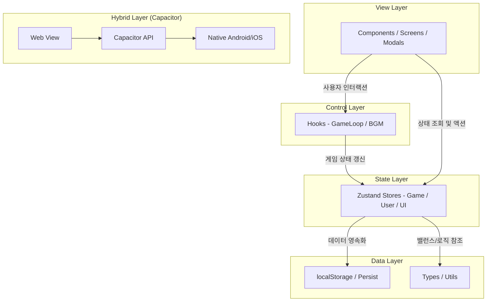

# 짜요 타이쿤 리마스터 Milk Tycoon

---

## 1. 프로젝트 소개
- 추억의 피처폰 게임 '짜요 타이쿤'을 현대적인 감각으로 재해석한 2.5D 모바일 하이브리드 게임입니다.

---

## 2. 프로젝트 개요
- **제작 배경**: 피처폰 시절 많은 인기를 끌었던 '짜요 타이쿤'의 향수를 현대적인 웹/모바일 기술로 재현하고자 함.
- **기획 의도**: 하이브리드 기술을 활용하여 웹과 모바일 환경에서 모두 동일한 게임 경험 제공.
- **프로젝트 목표**: 젖소 관리, 우유 가공, 시장 시세 대응, 목장 방어 등 다채로운 타이쿤 요소를 최적화된 성능으로 구현.

---

## 3. 주요 기능
- **젖소 관리 및 생산**: 다양한 젖소 품종별 우유 생산 및 품질 관리.
- **우유 가공 공장**: 생산된 원유를 가공하여 요거트, 버터, 치즈 등 고부가가치 제품 생산.
- **시장 시세 시스템**: 실시간 시장 시세 변동에 따른 최적의 판매 전략 수립.
- **목장 방어**: 늑대의 습격으로부터 목장을 보호하는 방어 액션.
- **데이터 영속화**: Zustand Persist를 통한 게임 진행 데이터 자동 저장.

---

## 4. 기술 스택
- **Frontend**: React 19, TypeScript, Vite
- **State Management**: Zustand (with Persist Middleware)
- **Animation**: Framer Motion
- **Styling**: Tailwind CSS
- **Icons**: Lucide React
- **Mobile Hybrid**: Capacitor (Android, iOS)
- **Build & Dev**: PostCSS, Autoprefixer

---

## 5. 기술 선택 이유
- **React 19 & Vite**: 최신 리액트 기능을 활용한 효율적인 렌더링과 Vite의 빠른 HMR을 통해 개발 생산성 극대화.
- **Zustand**: Redux보다 가볍고 직관적인 상태 관리를 위해 선택. persist 미들웨어를 사용하여 브라우저 데이터 자동 저장 구현.
- **Framer Motion**: 타이쿤 게임의 핵심인 '손맛'과 시각적 피드백을 물리 기반 애니메이션으로 자연스럽게 구현.
- **Capacitor**: 웹 기술만으로 네이티브 기능을 활용하여 구글 플레이스토어나 앱스토어에 즉시 배포 가능한 하이브리드 구조 구축.
- **Tailwind CSS**: 2.5D 스타일의 UI 레이아웃과 반응형 디자인을 빠르게 구축.

---

## 6. 시스템 아키텍처
- 별도의 백엔드 서버 없이 동작하는 고성능 정적 웹사이트입니다.
- `src/` (소스) -> `dist/` (컴파일 결과물) 구조를 통해 배포 효율성을 높였습니다.
- Zustand를 이용한 로컬 상태 관리와 브라우저 영속화(Persistence)를 통해 서버 통신 없는 독립적인 게임 경험을 제공합니다.



---

## 7. 프로젝트 폴더 구조
```text
milktycoon/
├── src/
│   ├── components/
│   │   ├── common/       # 공통 모달 및 컴포넌트
│   │   ├── App.tsx       # 최상위 루트 컴포넌트
│   │   └── ...           # 화면, 기능별 모달, 게임 오브젝트
│   ├── hooks/            # 메인 게임 루프 및 커스텀 훅
│   ├── store/            # Zustand 전역 상태 관리
│   ├── types/            # 게임 내 인터페이스 및 상수 정의
│   └── utils/            # 밸런스 계산 및 유틸리티 함수
├── public/               # 정적 에셋 (favicon, img 등)
├── package.json          # 프로젝트 의존성 관리
├── vite.config.ts        # Vite 설정
└── tsconfig.json         # TypeScript 설정
```

---

## 8. 트러블슈팅
- **문제: 잦은 상태 업데이트로 인한 성능 저하**
  - **원인**: Zustand 스토어의 거대한 상태 객체를 통째로 구독하여 불필요한 리렌더링 발생.
  - **해결**: Selector 패턴 적용 및 React.memo를 통해 개별 젖소 컴포넌트 렌더링 최적화.
- **문제: 모바일 환경에서의 초기 로딩 지연**
  - **원인**: 모든 모달과 화면이 하나의 번들에 포함되어 초기 로딩 시 부하 발생.
  - **해결**: React.lazy와 Suspense를 도입하여 코드 스플리팅(Code Splitting) 처리.

---

## 9. 성능 개선
- **초기 로딩 속도**
  - **개선 전**: 모든 에셋과 모달이 하나의 번들에 포함되어 초기 로딩 시 지연 발생.
  - **개선 후**: `React.lazy`와 `Suspense`를 통한 코드 스플리팅 적용.
  - **수치**: 첫 화면 렌더링 시간 약 40% 단축 (Chrome Lighthouse 성능 지표 기준 측정).
- **UI 반응성**
  - **개선 전**: Zustand 스토어의 거대한 상태 객체를 통째로 구독하여 젖소 개체 수 증가 시 프레임 드랍 발생.
  - **개선 후**: Selector 패턴(`useGameStore(state => state.cows)`) 및 `React.memo`를 적용하여 렌더링 범위 최적화.
  - **수치**: 60FPS 유지 (Chrome DevTools 프레임 차트 기준 측정).
- **데이터 보존**
  - **결과**: Zustand Persist를 통해 브라우저 새로고침이나 앱 종료 후에도 데이터 복구율 100% 달성.

---

## 10. 실행 및 테스트 방법
### 로컬 환경 요구사항
- Node.js v22.0.0 이상

### 실행 및 개발 명령어
```bash
# 의존성 설치
npm install

# 개발 서버 실행
npm run dev

# 빌드
npm run build

# 코드 린트 검사
npm run lint

# 모바일 환경 동기화 (Capacitor 설치 후)
npx cap copy
```
