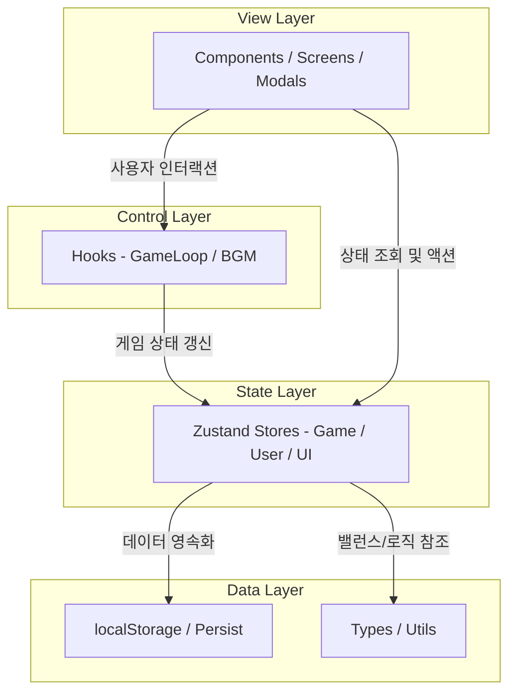

# 짜요 타이쿤 리마스터 Milk Tycoon

---

## 1. 프로젝트 소개
- 추억의 피처폰 게임 '짜요 타이쿤'을 현대적인 감각으로 재해석한 2.5D 웹 게임입니다

---

## 2. 프로젝트 개요
- **제작 배경**: 피처폰 시절 많은 인기를 끌었던 '짜요 타이쿤'의 향수를 현대적인 웹/모바일 기술로 재현하고자 함
- **기획 의도**: 설치 없이 브라우저에서 바로 즐기는 가벼운 게임 경험 제공
- **프로젝트 목표**: 젖소 관리, 우유 가공, 시장 시세 대응, 목장 방어 등 다채로운 타이쿤 요소를 브라우저에서 동작하는 게임으로 구현

---

## 3. 주요 기능
- **젖소 관리 및 생산**: 다양한 젖소 품종별 우유 생산 및 품질 관리
- **우유 가공 공장**: 생산된 원유를 가공하여 요거트, 버터, 치즈 등 고부가가치 제품 생산
- **시장 시세 시스템**: 30초마다 바뀌는 뉴스·시세 배율이 상인 매입가에 반영되며 가공 효율은 가공품 판매가에 반영됩니다
- **목장 방어**: 늑대의 습격으로부터 목장을 보호하는 방어 액션
- **랭킹**: 서버가 없어 실제 사용자 랭킹이 아니라, 가상 플레이어와 내 점수를 비교하는 **가상 라이벌 랭킹**입니다
- **데이터 영속화**: Zustand Persist를 통한 게임 진행 데이터 자동 저장

---

## 4. 기술 스택
- **Frontend**: React 19, TypeScript, Vite
- **State Management**: Zustand (with Persist Middleware)
- **Animation**: Framer Motion
- **Styling**: Tailwind CSS
- **Icons**: Lucide React
- **Build & Dev**: PostCSS, Autoprefixer

---

## 5. 기술 선택 이유
- **React 19 & Vite**: 최신 리액트 기능을 활용한 효율적인 렌더링과 Vite의 빠른 HMR을 통해 개발 생산성 극대화
- **Zustand**: Redux보다 가볍고 직관적인 상태 관리를 위해 선택 persist 미들웨어를 사용하여 브라우저 데이터 자동 저장 구현
- **Framer Motion**: 타이쿤 게임의 핵심인 '손맛'과 시각적 피드백을 물리 기반 애니메이션으로 자연스럽게 구현
- **Tailwind CSS**: 2.5D 스타일의 UI 레이아웃과 반응형 디자인을 빠르게 구축

---

## 6. 시스템 아키텍처
- 별도의 백엔드 서버 없이 동작하는 고성능 정적 웹사이트입니다
- `src/` (소스) -> `dist/` (빌드 결과물, GitHub Pages로 배포)
- Zustand를 이용한 로컬 상태 관리와 브라우저 영속화(Persistence)를 통해 서버 통신 없는 독립적인 게임 경험을 제공합니다


```mermaid
graph TD
    subgraph View Layer
        Components[Components / Screens / Modals]
    end
    
    subgraph Control Layer
        Hooks[Hooks - GameLoop / BGM]
    end
    
    subgraph State Layer
        Store[Zustand Stores - Game / User / UI]
    end
    
    subgraph Data Layer
        Persist[localStorage / Persist]
        Types[Types / Utils]
    end

    Components -->|사용자 인터랙션| Hooks
    Hooks -->|게임 상태 갱신| Store
    Store -->|데이터 영속화| Persist
    Store -->|밸런스/로직 참조| Types
    Components -->|상태 조회 및 액션| Store
```

---

## 7. 프로젝트 폴더 구조
```text
milktycoon/
├── src/
│   ├── components/
│   │   ├── common/       # 공통 모달 및 컴포넌트
│   │   ├── App.tsx       # 최상위 루트 컴포넌트
│   │   └── ...           # 화면, 기능별 모달, 게임 오브젝트
│   ├── hooks/            # 메인 게임 루프 및 커스텀 훅
│   ├── store/            # Zustand 전역 상태 관리
│   ├── types/            # 게임 내 인터페이스 및 상수 정의
│   └── utils/            # 밸런스 계산 및 유틸리티 함수
├── public/               # 정적 에셋 (favicon, img 등)
├── package.json          # 프로젝트 의존성 관리
├── vite.config.ts        # Vite 설정
└── tsconfig.json         # TypeScript 설정
```

---

## 8. 트러블슈팅
- **문제: 잦은 상태 업데이트로 인한 성능 저하**
  - **원인**: Zustand 스토어의 거대한 상태 객체를 통째로 구독하여 불필요한 리렌더링 발생
  - **해결**: Selector 패턴 적용 및 React.memo를 통해 개별 젖소 컴포넌트 렌더링 최적화(렌더링 횟수나 프레임은 측정하지 않았습니다)
- **문제: 모든 화면이 한 번들에 포함됨**
  - **원인**: 모든 모달과 화면이 하나의 번들에 포함되어 초기 로딩 부담이 커질 수 있음
  - **해결**: React.lazy와 Suspense를 도입하여 코드 스플리팅(Code Splitting) 처리

---

## 9. 성능 개선
- **초기 로딩 속도**
  - **적용**: 모든 화면과 모달이 하나의 번들에 들어가던 것을 `React.lazy`와 `Suspense`로 나눴습니다. 로딩 시간은 측정하지 않았습니다
- **UI 반응성**
  - **적용**: 스토어를 통째로 구독하지 않고 Selector 패턴(`useGameStore(state => state.cows)`)과 `React.memo`로 렌더링 범위를 줄였습니다. 개선 폭은 측정하지 않았습니다
- **데이터 보존**
  - **결과**: Zustand Persist로 새로고침 후에도 진행 상황을 복원합니다 함수(actions)는 저장 대상에서 제외하고 `version`·`migrate`로 이전 저장본을 정리합니다

---

## 10. 실행 및 테스트 방법
### 로컬 환경 요구사항
- Node.js v22.0.0 이상

### 실행 및 개발 명령어
```bash
# 의존성 설치
npm install

# 개발 서버 실행
npm run dev

# 빌드
npm run build

# 코드 린트 검사
npm run lint
```

---

## 11. 프로젝트 링크 Project Links
- **Frontend (GitHub Pages)**: https://hamjoong.github.io/portfolio/milktycoon/