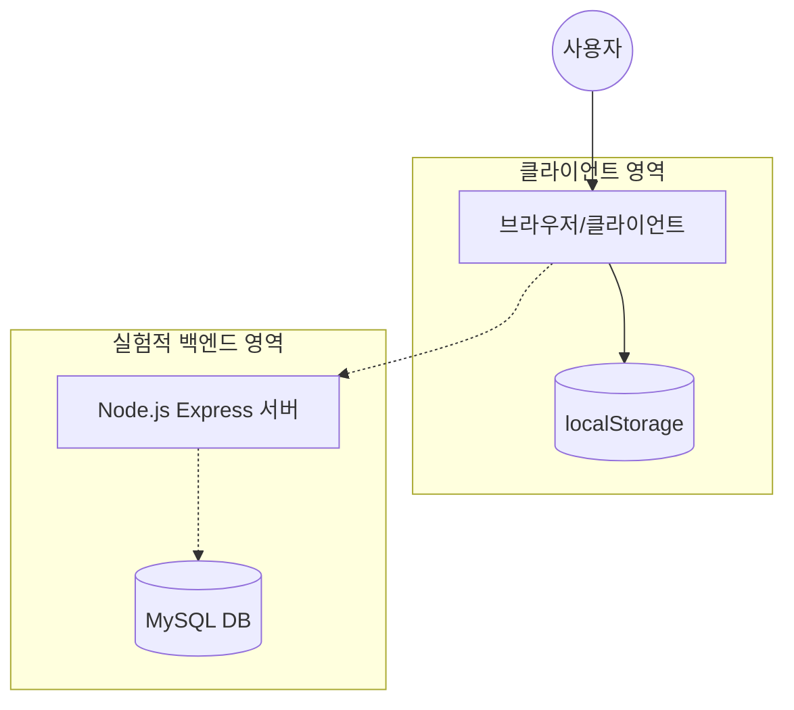

# 웹 메모장 서비스 Note Pad

---

## 1. 프로젝트 소개
브라우저 로컬 저장소를 활용하여 직관적인 UI로 아이디어를 즉시 기록하고 안전하게 관리할 수 있는 반응형 웹 메모장 서비스입니다.

---

## 2. 프로젝트 개요
- **제작 배경**: 별도의 서버 구축이나 복잡한 과정 없이 웹 브라우저에서 바로 아이디어를 기록할 개인용 도구가 필요하여 제작.
- **기획 의도**: 학습 및 포트폴리오 목적으로 정적 웹 페이지에서 클라이언트 사이드 데이터 영속성 처리 경험을 쌓고자 함.
- **프로젝트 목표**:
    - 브라우저 `localStorage`를 활용하여 데이터 영속성 구현.
    - 사용자 친화적인 커스텀 모달 및 반응형 UI 제공.

---

## 3. 주요 기능
- **메모 작성 및 유효성 검사**: 제목과 내용 입력 시 빈 값 등록을 방지(`trim()` 활용).
- **데이터 영속성 보장**: `localStorage`를 활용하여 새로고침 또는 브라우저 재접속 시에도 데이터 유지.
- **메모 수정**: 등록된 메모를 수정 모드로 불러와 즉시 재편집 가능.
- **안전한 삭제**: 커스텀 확인 모달을 통한 실수 방지.

---

## 4. 기술 스택
- **Markup**: Pug (HTML 템플릿)
- **Styling**: SCSS (Sass), XEIcon
- **Script**: Vanilla JavaScript (ES6+), jQuery
- **Storage**: Web Storage API (`localStorage`)
- **Dev Tools / Server**: npm, simplehttpserver

---

## 5. 기술 선택 이유
- **Pug/SCSS**: 반복되는 마크업 구조를 효율화하고 유지보수가 용이한 스타일 구조를 확보하기 위해 선택.
- **Vanilla JS**: 프레임워크 의존성을 제거하고 브라우저의 기본 성능을 극대화하기 위해 채택.
- **jQuery**: DOM 요소 제어 및 이벤트 위임 처리를 신속하게 구현하기 위해 도입.

---

## 6. 시스템 아키텍처
- **계층 구조**: 클라이언트 중심의 정적 웹 서비스로 실험적으로 백엔드 연동을 고려한 구조입니다.



---

## 7. 프로젝트 폴더 구조
```bash
notepad/
├── build/             # 최종 빌드 결과물 (서빙 디렉토리)
│   ├── css/           # 컴파일된 스타일시트
│   ├── favicon/       # 파비콘 에셋
│   ├── html/          # 컴파일된 HTML
│   └── script/        # 클라이언트 스크립트
├── src/               # 소스 코드
│   ├── pug/           # Pug 템플릿 소스
│   └── scss/          # SCSS 스타일 소스
├── notepaddb.js       # (실험/확장용) MySQL 연결 스크립트
├── notepadnode.js     # (실험/확장용) Express 서버 스크립트
└── package.json       # 프로젝트 의존성 및 실행 스크립트
```

---

## 8. 트러블슈팅
- **데이터 유실 문제**:
    - **문제**: 정적 웹 페이지 특성상 새로고침 시 DOM 초기화로 인한 데이터 손실.
    - **원인**: 메모 데이터를 메모리상(DOM)에만 임시로 생성하여 브라우저 새로고침 시 초기화됨.
    - **해결**: `JSON.stringify`/`JSON.parse`를 사용하여 `localStorage`에 데이터를 직렬화/역직렬화하여 저장 및 불러오기 기능 구현.
- **삭제 UX 개선**:
    - **문제**: 브라우저 기본 `confirm()` 사용 시 디자인 이질감 및 실수 삭제 위험.
    - **원인**: 브라우저 기본 내장 모달 사용으로 인한 스타일링 제한 및 즉각적인 삭제 처리 로직.
    - **해결**: 프로젝트 디자인 톤에 맞춘 커스텀 모달 레이어를 구현하여 사용자 경험 및 안정성 향상.

---

## 9. 성능 개선
- **성능 개선 포인트**: 서버 통신을 최소화하여 초기 렌더링 속도 향상.
- **개선 전/후 수치와 측정 방법**:
    - **개선 전**: 서버 통신 기반 데이터 로딩으로 인해 네트워크 지연 시간 발생.
    - **개선 후**: `localStorage` 활용으로 로컬 데이터 즉시 로딩, 네트워크 지연 시간 0ms 달성.
    - **측정 방법**: 브라우저 개발자 도구의 Network 탭에서 불필요한 데이터 요청 유무 확인.

---

## 10. 실행 및 테스트 방법
- **로컬 환경 요구사항**: Node.js 설치 (`npm` 사용 가능 환경)
- **설치 및 실행 명령어**:
    - 설치: `npm install`
    - 실행: `npm start`
- **테스트 실행 방법**:
    - 현재 기본 테스트 스크립트: `npm test`
