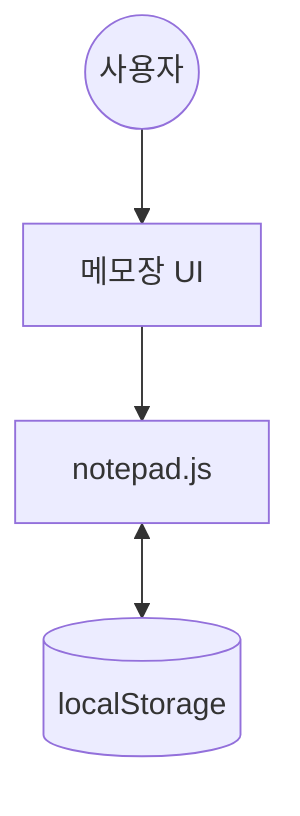

# 웹 메모장 서비스 Note Pad

---

## 1. 프로젝트 소개
브라우저 로컬 저장소를 활용하여 직관적인 UI로 아이디어를 즉시 기록하고 안전하게 관리할 수 있는 반응형 웹 메모장 서비스입니다.

---

## 2. 프로젝트 개요
- **제작 배경**: 서버 구축 없이 브라우저에서 바로 아이디어를 기록할 개인용 도구가 필요했습니다.
- **기획 의도**: 정적 웹 페이지에서 클라이언트 사이드 데이터 영속성을 직접 다뤄 보는 학습 목적 서버 연동 없이 로컬 상태만으로 동작하도록 범위를 확정했습니다.
- **목표**
    - `localStorage` 기반 데이터 영속성 구현
    - 커스텀 모달과 반응형 UI 제공

---

## 3. 주요 기능기능

| 기능 | 구현 방식 | 근거 위치 |
|---|---|---|
| 메모 작성 + 빈 값 방지 | 제목·내용 `trim()` 후 비어 있으면 `alert` 로 차단 | `notepad.js` 저장 버튼 핸들러 |
| 데이터 영속성 | `JSON.stringify` / `JSON.parse` 로 `localStorage`(`notepad_notes`) 저장·복원, 페이지 로드 시 `loadNotes()` 실행 | `loadNotes`, `saveNoteToStorage` |
| 메모 수정 | 카드 내용을 입력창으로 불러와 재편집 후 다시 저장 | `.edit_btn` 핸들러 |
| 안전한 삭제 | 커스텀 확인 모달(삭제/취소)을 거쳐 삭제 | `.delete_btn`, 모달 핸들러 |
| 저장소 예외 처리 | 저장·조회·삭제 모두 `try/catch`, 실패 시 사용자에게 알림 | `notepad.js` 전반 |
| 빈 값 표시 | 저장값이 비어 있으면 "제목 없음/내용 없음"으로 표시 | `loadNotes` |
| 긴 텍스트 대응 | 제목은 한 줄 말줄임(`ellipsis`), 내용은 `word-break` + 내부 스크롤 | `notepad.scss` |

---

## 4. 기술 스택
- **Markup**: Pug (HTML 템플릿)
- **Styling**: SCSS (Sass), XEIcon, Google Fonts(Gowun Batang)
- **Script**: Vanilla JavaScript (ES6+), jQuery 3.6
- **Storage**: Web Storage API (`localStorage`)
- **Dev Server**: npm, simplehttpserver

---

## 5. 기술 선택 이유
- **Pug/SCSS**: 반복되는 마크업·스타일을 믹스인/템플릿으로 묶어 유지보수 비용을 줄이기 위해 선택.
- **Vanilla JS**: 입력·저장·렌더링 같은 핵심 로직은 프레임워크 없이 직접 구현해 동작 원리를 학습하기 위해 채택.
- **jQuery**: 동적으로 생성되는 카드의 수정·삭제 버튼에 **이벤트 위임**(`$(document).on`)을 간결하게 적용하고 모달 표시/숨김을 처리하기 위해 도입.

---

## 6. 시스템 아키텍처
서버 없이 브라우저 안에서 모든 처리가 끝나는 클라이언트 단독 구조입니다.


```mermaid
graph TD
    User((사용자)) --> UI[메모장 UI]
    UI --> Script[notepad.js]
    Script <--> LocalStorage[(localStorage)]
```

### 데이터 흐름
1. 저장: 입력값 `trim()` 검증 → `localStorage` 배열에 `{id, title, contents}` 추가 → 화면에 카드 생성
2. 로드: `DOMContentLoaded` → `localStorage` 파싱 → 카드 렌더링
3. 삭제: 모달 확인 → ID 기준 `filter` → 저장소·DOM 동시 갱신

---

## 7. 프로젝트 폴더 구조
```bash
notepad/
├── build/             # 빌드 결과물
│   ├── css/           # 컴파일된 스타일시트
│   ├── favicon/       # 파비콘 에셋
│   ├── html/          # 컴파일된 HTML
│   ├── pdf/           # 프로젝트 소개 자료 (PDF/PPTX)
│   └── script/        # 클라이언트 스크립트
├── src/               # 소스 코드
│   ├── build/css/     # SCSS 컴파일 출력 (build/css 로 배포)
│   ├── pug/           # Pug 템플릿 소스
│   └── scss/          # SCSS 스타일 소스
└── package.json       # 의존성 및 실행 스크립트
```

---

## 8. 트러블슈팅

### 8-1. 새로고침 시 메모 유실
| | 내용 |
|---|---|
| **문제** | 새로고침하면 작성한 메모가 모두 사라짐 |
| **원인** | 메모를 DOM에만 생성해 두어, 페이지가 다시 로드되면 메모리 상태가 초기화됨 |
| **해결** | 메모를 `{id, title, contents}` 배열로 `JSON.stringify` → `localStorage` 저장, 로드 시 `JSON.parse` 로 복원해 렌더링 |
| **근거** | 새로고침·브라우저 재접속 후에도 DevTools → Application → Local Storage(`notepad_notes`)에 데이터가 유지되고 화면에 복원됨 |

### 8-2. 삭제 UX 및 오삭제 위험
| | 내용 |
|---|---|
| **문제** | 기본 `confirm()` 은 디자인 이질감이 크고 즉시 삭제로 실수 위험이 있음 |
| **원인** | 브라우저 내장 대화상자는 스타일링이 불가능 |
| **해결** | 디자인 톤에 맞춘 커스텀 모달 구현 삭제 대상을 `articleToDelete` 에 보관했다가 확인 시에만 삭제 취소 시 초기화 |
| **근거** | 삭제 버튼 클릭 → 모달 → [취소] 시 저장소 변화 없음 [삭제] 시에만 저장소·화면에서 제거 |

### 8-3. 동적 생성 요소의 이벤트 미동작
| | 내용 |
|---|---|
| **문제** | 저장 후 새로 생기는 카드의 수정/삭제 버튼이 동작하지 않을 수 있음 |
| **원인** | 카드가 로드 시점 이후 동적으로 생성되어 개별 바인딩이 불가능 |
| **해결** | `$(document).on('click', '.edit_btn' / '.delete_btn', ...)` 이벤트 위임으로 상위 요소에서 처리 |

### 8-4. 저장소 접근 실패 대응
| | 내용 |
|---|---|
| **문제** | 저장 공간 제한·손상된 JSON 등으로 읽기/쓰기가 실패하면 앱 전체가 멈출 수 있음 |
| **해결** | 저장·조회·삭제를 `try/catch` 로 감싸고 저장 실패 시 `null` 반환 → "저장에 실패했습니다" 안내 후 입력값 유지 |

### 8-5. 수정 도중 취소 시 원본 유실
| | 내용 |
|---|---|
| **문제** | 수정 버튼을 누르는 즉시 원본을 삭제해 저장하지 않고 이탈하면 메모가 사라짐 |
| **원인** | "삭제 후 재저장" 방식으로 수정을 구현 |
| **해결** | 수정 중인 카드를 `editingArticle` 에 보관하고 **새 내용 저장이 성공한 뒤에만** 원본을 제거 |

### 8-6. 사용자 입력의 HTML 해석(XSS) 방지
| | 내용 |
|---|---|
| **문제** | 메모에 `<b>`, `<script>` 같은 문자열을 입력하면 HTML 로 해석될 수 있음 |
| **원인** | 카드 생성 시 입력값을 `innerHTML` 템플릿에 직접 삽입 |
| **해결** | 입력값은 `textContent` 로 주입. 템플릿에는 고정 마크업만 유지 |

### 8-7. 메모 ID 충돌 방지
같은 밀리초에 저장되어도 `Date.now()` ID 가 겹치지 않도록, 기존 ID 와 중복되면 값을 올려 고유성을 보장했습니다.

---

## 9. 성능 개선
- **개선 포인트**: 서버 통신 없이 `localStorage` 로 즉시 읽고 쓰는 구조 채택.
- **결과**: 메모 저장·조회·삭제 경로에 네트워크 요청이 없습니다(`notepad.js` 에 `fetch`/`XMLHttpRequest` 호출 없음) 서버·DB 왕복이 필요한 방식 대비 네트워크 지연 요소가 구조적으로 제거됩니다.
- **확인 방법**: DevTools Network 탭에서 메모 저장·삭제·새로고침 시 메모 데이터 관련 요청이 없는지 확인.
- **참고**: 응답 시간(ms) 등 정량 수치는 측정하지 않았습니다. (외부 폰트·jQuery·XEIcon CDN 요청은 별개)

---

## 10. 설계 범위와 한계
개인용 로컬 메모장이라는 범위에 맞춰 아래와 같이 설계했습니다.
- **저장 범위**: `localStorage` 는 브라우저·기기별로 분리되며 사이트 데이터를 지우면 메모도 사라집니다. (동기화·백업은 범위 밖)
- **긴 텍스트**: 제목은 말줄임 내용은 내부 스크롤로 레이아웃이 깨지지 않게 처리했습니다.
- **외부 CDN**: jQuery·폰트·XEIcon 은 CDN 을 사용하므로 오프라인에서는 스타일·아이콘이 제한됩니다.

---

## 11. 실행 및 테스트 방법
- **요구사항**: Node.js (`npm` 사용 가능 환경)
- **설치**: `npm install`
- **실행**: `npm start` 후 `http://localhost:8000/html/notepad.html` 접속 (`build/` 를 정적 서버로 서빙)
- **테스트**: 자동 테스트는 없으며 수동 시나리오로 확인합니다.
    1. 빈 제목/내용으로 저장 → 차단 알림
    2. 메모 저장 후 새로고침 → 유지 확인
    3. 수정 → 내용 변경 후 재저장
    4. 삭제 → 모달에서 취소/삭제 각각 확인
    5. 화면 폭 768px 이하에서 레이아웃 확인
