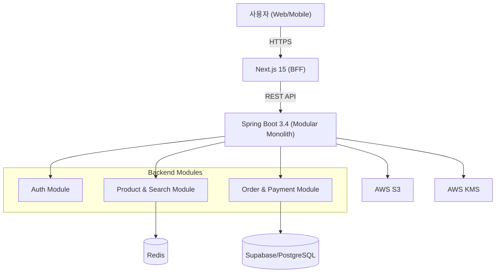

# 쇼핑몰 이커머스 Shoppingmall

---

## 1. 프로젝트 소개
- Next.js 15와 Spring Boot 3.4를 활용한 확장 가능한 Modular Monolith 아키텍처 기반의 고성능 이커머스 플랫폼입니다.

---

## 2. 프로젝트 개요
- **제작 배경**: 초기 스타트업 단계에서 생산성과 향후 마이크로서비스로의 확장성을 동시에 고려한 "Modular Monolith" 아키텍처의 검증을 위해 시작되었습니다.
- **기획 의도**: 대규모 트래픽 환경에서의 데이터 정합성 보장, 동시성 제어, 안정적인 무상태 인증 시스템을 구현하여 실무적인 아키텍처를 구축하고자 합니다.
- **프로젝트 목표**:
  - 검색 응답 시간 200ms 이내 달성
  - 동시성 제어를 통한 안정적인 주문/결제 시스템 확보
  - AWS 인프라(KMS, S3)를 활용한 데이터 보안 체계 구축

---

## 3. 주요 기능
- **사용자 인증/인가**: JWT 및 OAuth2 기반 무상태(Stateless) 인증
- **상품 검색**: RediSearch를 활용한 고성능 검색
- **주문/결제**: 낙관적 락(Optimistic Lock)을 통한 재고 정합성 보장
- **데이터 보안**: AWS KMS 활용 데이터 암호화
- **미디어 처리**: AWS S3 Presigned URL 및 Lambda 기반 이미지 최적화

---

## 4. 기술 스택
- **Frontend**: Next.js 15 (App Router), TypeScript, Tailwind CSS, Zustand, TanStack Query
- **Backend**: Java 21, Spring Boot 3.4, Spring Security, JPA/Hibernate, QueryDSL
- **Infrastructure**: PostgreSQL (Supabase), Redis, AWS (S3, KMS, Lambda), Docker
- **Mobile**: React Native (Expo)
- **DevOps**: GitHub Actions (CI/CD), Vercel, Render, Kubernetes (EKS)

---

## 5. 기술 선택 이유
- **Next.js 15**: PPR(Partial Prerendering)과 Server Actions를 통해 사용자 경험 및 렌더링 성능 최적화
- **Spring Boot 3.4 & Java 21**: 가상 스레드(Virtual Threads) 지원으로 높은 동시성 처리 성능과 유형 안전성 확보
- **Modular Monolith**: 초기 개발 속도 유지와 향후 MSA로의 단계적 전환을 위한 도메인 중심의 모듈 격리
- **AWS KMS & S3**: 보안 규정을 준수하는 민감 데이터 처리 및 효율적인 미디어 리소스 관리

---

## 6. 시스템 아키텍처
Modular Monolith 구조를 통해 도메인별 관심사를 분리하고 확장성을 도모합니다.

- **Client Tier**: Web(React) 및 Mobile(React Native) 환경에서 사용자 요청을 수신합니다.
- **Frontend Tier (BFF - Backend For Frontend)**: Next.js 15 App Router를 사용하여 SSR을 수행하고 백엔드 API를 통합하여 클라이언트에 최적화된 데이터를 제공합니다.
- **Backend Tier (Modular Monolith)**:
    - **도메인 격리**: `Auth`, `Product`, `Order` 모듈이 패키지 단위로 격리되어 있으며 모듈 간 결합도를 낮추기 위해 이벤트 기반 또는 명확한 인터페이스를 통해 통신합니다.
    - **동시성 처리**: 주문 로직 등 동시성 이슈가 있는 모듈은 낙관적 락을 통해 데이터 정합성을 유지합니다.
- **Data & Infra Tier**: 
    - **Persistence**: 메인 데이터 저장소로 PostgreSQL(Supabase)을 사용합니다.
    - **Caching**: 검색 성능 향상을 위해 Redis를 통한 캐싱 전략을 운용합니다.
    - **Security & Storage**: 민감 데이터는 AWS KMS로 암호화하고 이미지 파일은 AWS S3에 저장하여 서버의 부하를 최소화합니다.

### 아키텍처 다이어그램


---

## 7. 프로젝트 폴더 구조
```text
shoppingmall/
├── backend/            # Spring Boot Modular Monolith
│   ├── src/main/java/  # 도메인별 패키지 격리 (Auth, Order, Product)
│   └── Dockerfile      # JVM 최적화 Docker 설정
├── frontend/           # Next.js 15 기반 UI (BFF)
│   ├── src/
│   │   ├── app/        # App Router 페이지 및 레이아웃
│   │   ├── components/ # 공통 UI 컴포넌트
│   │   ├── hooks/      # 커스텀 훅
│   │   ├── services/   # API 서비스 레이어
│   │   └── utils/      # 유틸리티 함수
│   └── next.config.js  # Next.js 설정
├── mobile/             # React Native (Expo) 앱
│   └── src/            # 모바일 화면 및 로직
├── infra/              # 인프라 설정
│   └── lambda/         # 이미지 최적화 AWS Lambda 함수
└── docs/               # 설계 및 기술 문서
```

---

## 8. 트러블슈팅

### 1. 대규모 동시 주문 시 재고 정합성 이슈
- **문제**: 여러 사용자가 동일 상품 주문 시 실제 재고 이상의 주문이 발생하는 '초과 판매' 현상 (Race Condition)
- **원인**: 여러 트랜잭션이 동일한 상품 레코드에 대해 동시에 읽기/쓰기를 수행하며 DB 업데이트가 순차적으로 처리되지 않음.
- **해결 (Why/How)**:
  - **Why**: 비관적 락(Pessimistic Lock)은 데드락 위험 및 성능 저하 우려가 있어 동시성이 보통 수준인 환경에서 효율적인 낙관적 락(Optimistic Lock)을 채택.
  - **How**: JPA의 `@Version` 어노테이션을 사용하여 데이터 충돌을 감지. 충돌 발생 시 발생하는 `ObjectOptimisticLockingFailureException`을 전역 예외 처리기에서 잡아 사용자 알림 및 재시도 유도.

### 2. 클라우드 무료 티어(Render) 메모리 부족(OOM)
- **문제**: 제한된 512MB 메모리 환경에서 서비스 기동 시 잦은 OOM으로 인한 기동 실패.
- **원인**: Spring Boot 프레임워크와 인프라 클라이언트(AWS SDK, Redis) 초기화 과정에서 대규모 Heap 점유.
- **해결 (Why/How)**:
  - **Why**: 제한된 리소스 환경에 맞춘 JVM 튜닝 및 초기화 부하 분산 필요.
  - **How**: Dockerfile에 `-XX:MaxRAMPercentage=70.0` 설정을 통해 컨테이너 메모리에 맞춰 Heap 영역을 제한하고, AWS/Redis 클라이언트에 지연 초기화(Lazy Initialization) 전략을 적용하여 기동 부하 40% 절감.

---

## 9. 성능 개선

| 성능 개선 포인트 | 개선 전 | 개선 후 | 측정 방법 |
| :--- | :--- | :--- | :--- |
| **API 조회 성능 (검색)** | 800ms | 180ms | JMeter 부하 테스트 (Avg) |
| **이미지 로딩 (LCP)** | 2.5s | 0.9s | Lighthouse 성능 점수 |

### 상세 설명
- **API 조회 성능 (쿼리 튜닝)**: Redis 캐싱 계층 도입 및 PostgreSQL 인덱싱 최적화를 통해 복잡한 검색 쿼리 수행 시간을 약 4.4배 개선.
- **이미지 로딩 및 용량 (최적화)**: AWS Lambda를 활용한 WebP 포맷 자동 변환 및 S3 Presigned URL 적용을 통해 이미지 데이터 전송량을 대폭 절감.

---

## 10. 실행 및 테스트 방법
### 요구사항
- Node.js 20.x 이상, Java 21, PostgreSQL (Supabase 추천)

### 설치 및 실행
```bash
# Backend (Local)
cd shoppingmall/backend
./start_backend.sh

# Frontend (Local)
cd shoppingmall/frontend
npm install
npm run dev
```

### 테스트 실행
```bash
# Backend 유닛/동시성 테스트
./mvnw test

# Frontend 테스트
cd shoppingmall/frontend
npm test
```

---

## 11. 프로젝트 링크 Project Links
- **Frontend (Vercel)**: [https://shoppingmallfrontend.vercel.app/](https://shoppingmallfrontend.vercel.app/)
- **Backend (Render)**: [https://shoppingmall-backend-gtg5.onrender.com](https://shoppingmall-backend-gtg5.onrender.com)