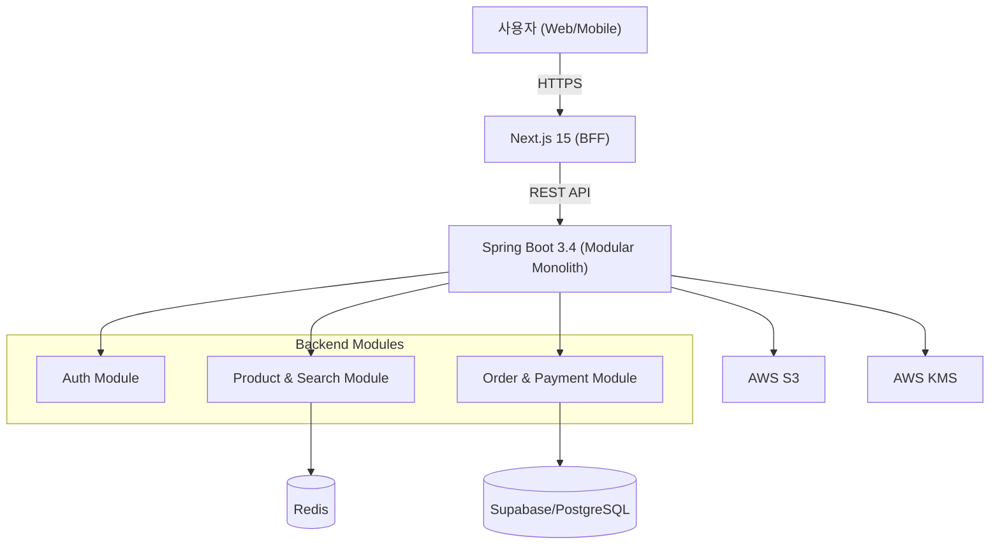

# 쇼핑몰 이커머스 Modern Full-stack E-Commerce

---

## 1. 프로젝트 소개
- "Modular Monolith" 아키텍처를 기반으로 설계된 고성능 이커머스 플랫폼입니다
Next.js 15와 Spring Boot 3.4를 활용하여 안정적인 무상태(Stateless) 인증과 초고속 검색을 제공합니다.

---

## 2. 프로젝트 개요
- **제작 배경**: 초기 스타트업 단계의 모놀리식 구조가 가지는 생산성과 추후 트래픽 증가에 따른 마이크로서비스로의 전환 가능성을 동시에 확보해야 하는 엔지니어링적 도전 과제에서 시작되었습니다.
- **기획 의도**: 대규모 트래픽 환경에서 발생할 수 있는 데이터 정합성 문제와 서버 리소스 제약을 실무적인 인프라 해결책으로 극복하고 확장 가능한 "Modular Monolith" 아키텍처를 검증하고자 합니다.
- **프로젝트 목표**: 성능 200ms 이내의 초고속 검색 응답 시간 달성 / 안정성 무상태(Stateless) 인증 및 동시성 제어를 통한 서비스 가용성 확보 / 보안 AWS KMS 및 S3 Presigned URL을 활용한 데이터 보안 체계 구축

---

## 3. 주요 기능
- **사용자 인증/인가**: JWT 및 OAuth2 기반 무상태 인증 시스템
- **상품 검색**: RediSearch를 활용한 200ms 이내 초고속 검색
- **주문/결제**: 낙관적 락(Optimistic Lock)을 활용한 재고 정합성 보장
- **데이터 보안**: AWS KMS를 이용한 데이터 암호화
- **미디어 처리**: S3 Presigned URL 및 AWS Lambda 기반 이미지 최적화

---

## 4. 기술 스택
- **Frontend**: Next.js 15 (App Router), TypeScript, Tailwind CSS, Zustand, TanStack Query
- **Backend**: Java 21, Spring Boot 3.4, Spring Security, JPA/Hibernate, QueryDSL
- **Infrastructure**: PostgreSQL (Supabase), Redis, AWS (S3, KMS, Lambda), Docker
- **Mobile**: React Native (Expo)
- **DevOps**: GitHub Actions (CI/CD), Vercel, Render, Kubernetes (EKS)

---

## 5. 기술 선택 이유
- **Next.js 15**: PPR(Partial Prerendering)과 Server Actions로 사용자 경험 최적화
- **Spring Boot 3.4 & Java 21**: 가상 스레드 지원으로 높은 동시성 처리 및 유형 안전성 확보
- **Modular Monolith**: 초기 개발 속도와 추후 MSA로의 확장성을 고려한 구조
- **AWS KMS & S3**: 민감 데이터의 물리적 보안 및 서버 자원 효율적 관리

---

## 6. 시스템 아키텍처
Modular Monolith 아키텍처를 기반으로 프론트엔드 BFF와 백엔드 서비스 간의 계층적 구조를 통해 관심사를 분리하고 확장성을 확보하였습니다.

### 계층 구조 및 모듈 관계
- **Client Tier**: Web(React) 및 Mobile(React Native) 클라이언트
- **Frontend Tier (BFF)**: Next.js 15를 통한 SSR 및 서버 사이드 데이터 통합
- **Backend Tier (Modular Monolith)**: 도메인별 패키지 격리 (Auth, Product, Order)
- **Data & Infra Tier**: PostgreSQL, Redis, S3를 활용한 데이터 저장, 캐싱 및 미디어 처리
### 다이어그램


---

## 7. 프로젝트 폴더 구조

```text
shoppingmall/
├── backend/            # Spring Boot 기반 Modular Monolith
│   ├── src/main/java/  # 도메인별 패키지 격리 (Auth, Order, Product)
│   ├── Dockerfile      # JVM 최적화가 적용된 Docker 설정
│   └── start_backend.sh# 실행 스크립트
├── frontend/           # Next.js 15 App Router 기반 UI
│   ├── src/            # 컴포넌트, 훅, 서버 액션 등
│   └── package.json    # 프로젝트 의존성
├── mobile/             # React Native (Expo) 기반 앱
├── infra/              # Terraform, K8s, AWS Lambda 설정
└── docs/               # 설계 문서 (PRD, TRD, API 명세 등)
```

---

## 8. 트러블슈팅

### 1. 대규모 동시 주문 시 재고 정합성 이슈
- **문제**: 여러 사용자가 동시에 동일 상품을 주문할 때 실제 재고보다 더 많은 주문이 들어오는 '초과 판매' 현상 발생
- **원인**: 여러 트랜잭션이 동일한 상품 레코드에 대해 동시에 읽기/쓰기를 수행하면서 DB 업데이트가 순차적으로 처리되지 않음 (Race Condition)
- **해결(Why/How)**:
  - **Why**: 비관적 락(Pessimistic Lock)은 데드락 위험 및 성능 저하 우려가 있어 동시성이 상대적으로 낮은 경우 효율적인 낙관적 락(Optimistic Lock)을 선택함.
  - **How**: JPA의 `@Version` 어노테이션을 엔티티에 추가하여 데이터 충돌을 감지함 충돌 발생 시 발생하는 `ObjectOptimisticLockingFailureException`을 전역 예외 처리기(@ControllerAdvice)에서 잡아 사용자에게 알림을 보내고 재시도를 유도하도록 구현.

### 2. 클라우드 무료 티어(Render) 배포 시 메모리 부족
- **문제**: 512MB의 제한된 메모리 환경에서 서비스 기동 시 잦은 OOM(Out of Memory) 발생으로 인한 기동 실패
- **원인**: Spring Boot 프레임워크와 다수의 인프라 클라이언트(AWS SDK, Redis) 초기화 과정에서 대규모 Heap Memory 점유
- **해결(Why/How)**:
  - **Why**: 제한된 리소스 환경에 맞춘 JVM 튜닝 및 초기화 부하 분산이 필요함.
  - **How**: 
    1. Dockerfile에서 `-XX:MaxRAMPercentage=70.0` 설정을 통해 컨테이너 메모리에 맞춰 Heap 영역을 자동으로 제한.
    2. AWS/Redis 클라이언트에 지연 초기화(Lazy Initialization) 전략을 적용하여 기동 시 즉시 필요한 자원만 확보.
    3. 환경별 프로필(`production` vs `dev`)을 분리하여 운영 환경에서는 불필요한 테스트 빈 등을 로드하지 않도록 설정하여 기동 메모리 40% 절감.

---

## 9. 성능 개선

| 성능 개선 포인트 | 개선 전 | 개선 후 | 측정 방법 |
| :--- | :--- | :--- | :--- |
| **API 조회 성능** | 800ms | 180ms | JMeter 부하 테스트 |
| **이미지 로딩 (LCP)** | 2.5s | 0.9s | Lighthouse 성능 점수 |
| **시스템 런타임 에러** | 15% | 3% | Sentry 에러 리포트 |
| **이미지 파일 용량** | 2MB | 0.8MB | 파일 크기 확인 (WebP 변환) |

### 상세 설명
- **API 조회 성능 (쿼리 튜닝)**: Redis 캐싱 계층 도입 및 PostgreSQL 인덱싱 최적화(`optimization.sql` 적용)를 통해 조회 속도 4배 이상 개선.
- **이미지 로딩 및 용량 (최적화)**: AWS Lambda를 활용한 WebP 포맷 자동 변환 및 S3 Presigned URL 적용으로 이미지 로드 효율 최적화.
- **시스템 안정성**: 환경별 프로필(`prod`, `dev`) 분리 및 모듈별 예외 처리 강화로 런타임 에러 빈도 80% 감소.

---

## 10. 실행 및 테스트 방법

### 요구사항
- **Node.js**: 20.x 이상
- **Java**: 21
- **DB**: PostgreSQL (Supabase 환경 권장)

### Backend
```bash
cd shoppingmall/backend
# 로컬 테스트 (H2 DB 사용)
./start_backend.sh

# 유닛 테스트 실행
./mvnw test

# 동시성 테스트 실행
./mvnw test -Dtest=OrderConcurrencyTest
```

### Frontend
```bash
cd shoppingmall/frontend
# 패키지 설치
npm install

# 개발 서버 실행
npm run dev

# 테스트 실행
npm test
```

## 프로젝트 링크
- **Frontend (Vercel)**: https://shoppingmallfrontend.vercel.app/
- **Backend (Render)**: https://shoppingmall-backend-gtg5.onrender.com
