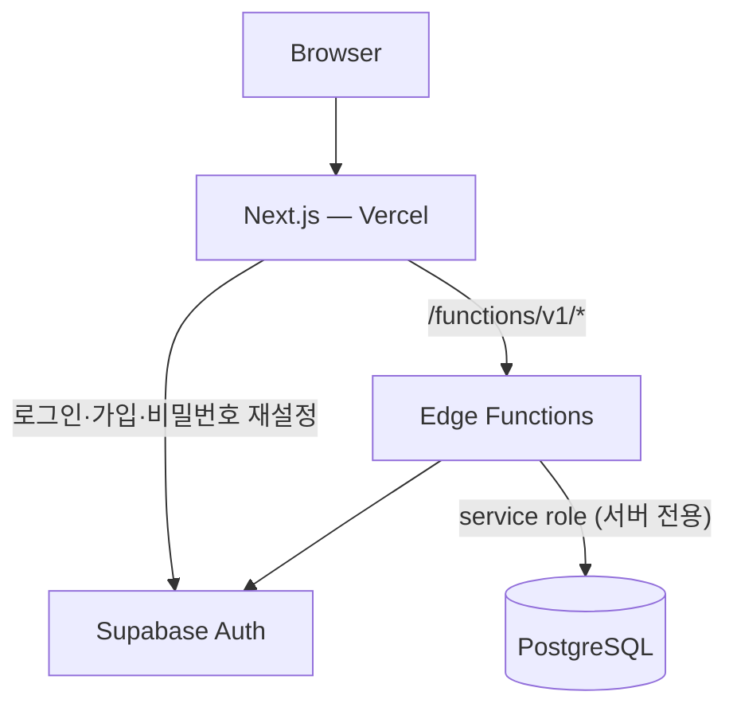

# 쇼핑몰 이커머스 Shoppingmall

## 1. 프로젝트 소개
Next.js 15 프런트엔드와 Supabase(Auth · PostgreSQL · Edge Functions)로 만든 이커머스 포트폴리오입니다.
상품 탐색, 장바구니, 주문(모의 결제), 비회원 주문 조회, 리뷰·Q&A, 관리자 상품·주문 관리까지 한 흐름으로 동작합니다.

> **결제는 모의입니다.** 외부 결제 연동이 없고, 주문하면 바로 `PAID` 상태가 됩니다. 실제 청구는 일어나지 않습니다.

## 2. 주요 기능
- **인증**: Supabase Auth 이메일/비밀번호 가입·로그인, 이메일 재설정 링크로 비밀번호 찾기, 회원탈퇴
- **상품**: 카테고리, 키워드 검색(이름·설명), 옵션(복수 선택, 옵션별 재고), 최근 본 상품
- **장바구니**: 회원은 계정, 비회원은 브라우저 식별자(`x-guest-id`)로 서버에 저장하고 로그인 시 병합
- **주문**: 선택한 모든 상품을 한 번에 주문. 가격·합계는 서버(DB)가 계산하고 재고는 한 트랜잭션에서 잠금·차감
- **비회원 주문**: 주문 시 이메일과 조회 비밀번호를 받고, 주문번호 + 이메일 + 조회 비밀번호로 조회(`/orders/lookup`). 실패 사유는 구분하지 않고, 15분 안에 같은 주문번호로 10회 또는 같은 접속에서 20회 실패하면 429로 제한(오타를 고려해 넉넉하게 잡음. 접속 식별은 IP 원문이 아니라 서버 비밀 키로 만든 HMAC 해시만 저장하고 1일 뒤 삭제). 주문 90일 후 개인정보를 지우는 함수 제공(`anonymize_expired_guest_orders`, 자동 실행은 설정하지 않았고 SQL Editor나 pg_cron에서 호출. DB 관리자 세션과 Edge의 service_role만 실행할 수 있음)
- **리뷰·Q&A**: 리뷰는 본인의 결제 완료 주문에 담긴 상품만 작성 가능(주문·상품당 1건). 관리자 답변 지원
- **회원탈퇴**: 결제 완료·배송 중 주문이 있으면 거절, 관리자 계정은 거절. 처리되면 주문의 수령인·연락처·주소는 익명화하고 계정 삭제
- **관리자**: 상품 CRUD, 주문 상태 변경, 사용자 목록, 대시보드 통계(관리자는 `admin_users` 테이블 등록으로만 부여)

## 3. 기술 스택

| 구분 | 기술 |
|---|---|
| Frontend | Next.js 15 (App Router), TypeScript, Tailwind CSS, Zustand, TanStack Query |
| API | Supabase Edge Functions (Deno): `catalog`, `cart`, `order`, `review`, `qna`, `admin-products`, `account-withdrawal`, `health` |
| 인증 | Supabase Auth |
| Database | Supabase PostgreSQL (RLS, 제약 조건, RPC) |
| 배포 | Vercel (Frontend), Supabase (DB · Edge Functions) |

## 4. 구조


```mermaid
graph TD
    Browser --> Frontend["Next.js — Vercel"]
    Frontend -->|"로그인·가입·비밀번호 재설정"| Auth["Supabase Auth"]
    Frontend -->|"/functions/v1/*"| Edge["Edge Functions"]
    Edge -->|"service role (서버 전용)"| DB[("PostgreSQL")]
    Edge --> Auth
```

- 브라우저는 테이블을 직접 읽거나 쓰지 않고(프로필·배송지 제외) Edge Function을 거칩니다. 주문·재고·비회원 조회 정보처럼 클라이언트가 값을 정하면 안 되는 부분은 `service_role` 전용 RPC(`create_order_atomic`, `lookup_guest_order`, `anonymize_customer_account`)가 처리합니다.
- 서버 비밀 키는 Edge Function 환경(Secrets)에만 둡니다. 프런트에는 공개 URL과 publishable key만 넣습니다.
- 허용 origin은 Edge Function Secret `ALLOWED_ORIGINS`(쉼표 구분)로 지정합니다. 기본값은 `http://localhost:3000`뿐입니다.

```text
shoppingmall/
├── frontend/   # Next.js 앱 (src/app, components, hooks, services, store, utils)
├── supabase/
│   ├── functions/   # Edge Functions + _shared (http, 인증 헬퍼)
│   └── migrations/  # 순서대로 적용하는 SQL
└── docs/       # API · 아키텍처 · 기획 문서
```

## 5. 설계 메모
- **재고 정합성**: `create_order_atomic`이 상품·옵션 행을 `FOR UPDATE`로 잠근 뒤 재고를 확인·차감하고, 주문과 주문 항목을 같은 트랜잭션에 저장합니다. 판매 중(`FOR_SALE`)이 아닌 상품은 거절하고, 하나라도 실패하면 전체가 롤백됩니다. DB에는 `stock_quantity >= 0` 제약도 있습니다.
- **비회원 식별의 한계**: `x-guest-id`는 클라이언트가 만드는 값이라 장바구니 구분에만 쓰며, 주문 조회 권한으로 쓰지 않습니다.
- **마이그레이션**: 이미 적용된 파일은 고치지 않고 새 파일로 덮습니다. 과거 파일에는 더는 쓰지 않는 계정 연결(`auth_user_mappings`) 흔적이 남아 있습니다. 새 프로젝트로 옮길 때 하나로 합치는 것을 고려합니다.

## 6. 실행 및 검증

요구사항: Node.js 20 이상, Supabase 프로젝트(또는 Supabase CLI + Docker)

```bash
cd frontend
cp .env.example .env.local   # NEXT_PUBLIC_SUPABASE_URL / NEXT_PUBLIC_SUPABASE_PUBLISHABLE_KEY 입력
npm install
npm run dev
```

```bash
cd frontend && npm run lint && npm run build            # 프런트 검사
cd supabase/functions/_shared && node --test *.test.mjs # 공용 인증 로직 단위 테스트
```

### 검증 범위 (사실대로)
- 확인함: 프런트 `lint`/`tsc`/`build`, 공용 인증 로직 단위 테스트 7건, Edge Function 소스의 문법 검사
- **확인하지 못함**: Edge Function 실제 실행(Deno), 새 마이그레이션의 DB 적용, 동시 주문 실험, 브라우저 동작 전반
- 성능 수치(LCP, 응답 시간 등)는 측정한 적이 없어 싣지 않습니다.

## 7. 링크
- Frontend (Vercel): https://shoppingmallfrontend.vercel.app/
