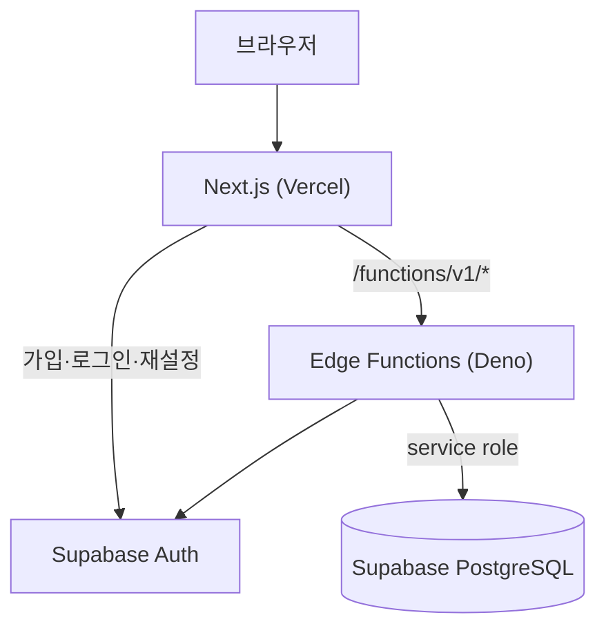

# 아키텍처

## 책임 분리
- **프런트엔드**: 화면, 클라이언트 상태(Zustand), 서버 상태(TanStack Query). 가격·재고·권한을 스스로 판단하지 않습니다.
- **Edge Functions**: 입력 검증, 인증된 사용자 확인, 권한 판단, 응답 정리(작성자 ID·DB 오류 문구 비노출). 공통 코드는 `functions/_shared`에 있습니다.
- **PostgreSQL**: 제약 조건(가격·재고 `>= 0`, 상태 값), RLS, 트랜잭션 RPC. 주문·재고·비회원 조회처럼 위·변조가 문제 되는 로직을 둡니다.

## 인증과 권한
- 인증 주체는 Supabase Auth UID 하나뿐입니다. Edge는 토큰을 `auth.getUser`로 확인하고 UID를 소유자 ID로 씁니다.
- 관리자는 `admin_users` 테이블에 UID가 있어야 합니다. 클라이언트가 보내는 role 값으로 판단하지 않습니다.
- 모든 테이블은 RLS를 켜 두고 브라우저의 직접 접근을 막습니다. 서버 키는 Edge Secret에만 있습니다.
- 비회원: `x-guest-id`로 장바구니만 구분합니다. 이 값은 클라이언트가 만들므로 주문 조회에는 쓰지 않고, 주문번호 + 이메일 + 조회 비밀번호(bcrypt 해시)로 조회합니다.

## 주문 흐름
1. 프런트가 선택한 모든 상품(`productId`, `optionId`, `quantity`)을 보냅니다. 가격은 보내지 않습니다.
2. `order` 함수가 입력을 검증하고 `create_order_atomic`을 호출합니다.
3. RPC가 상품·옵션 행을 잠그고 판매 상태·재고를 확인한 뒤 재고 차감, 주문·항목 저장, 장바구니 정리까지 한 트랜잭션으로 처리합니다. 실패하면 전부 롤백됩니다.
4. 결제는 모의이며 주문은 `PAID`로 저장됩니다.

## 개인정보 처리
- 회원탈퇴: 진행 중 주문이 없을 때만, 주문의 수령인·연락처·주소를 익명화하고 장바구니를 지운 뒤 Auth 계정을 삭제합니다. 익명화는 반복 호출해도 안전해서, 계정 삭제가 실패하면 다시 요청할 수 있습니다.
- 비회원 주문: `anonymize_expired_guest_orders(90)`이 90일 지난 주문의 수령 정보·이메일·조회 해시를 지웁니다. **자동 실행은 설정돼 있지 않으며** Supabase 스케줄러(pg_cron)나 수동 호출이 필요합니다.

## 알려진 한계
- 새 마이그레이션(`20261007000100_*`)과 Edge Function을 실제 Supabase에 적용해 검증하지 않았습니다.
- 과거 마이그레이션에 쓰지 않는 계정 연결 테이블 흔적이 남아 있습니다.
- 환불·주문 취소·재고 복구는 없습니다.
