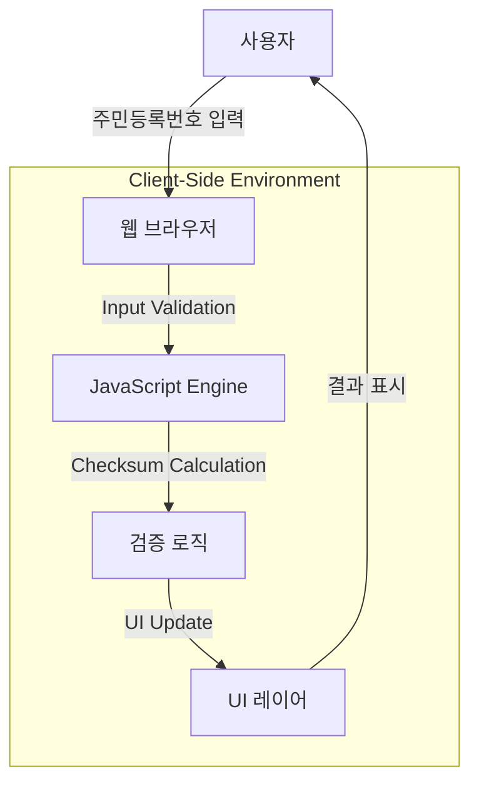

# 주민등록번호 유효성 검사기 (SSN Validator)

---

## 1. 프로젝트 소개
본 프로젝트는 웹 폼에서 주민등록번호 입력을 받는 모든 서비스 및 개인정보 보안을 중요시하는 사용자를 대상으로 대한민국 주민등록번호 체계에 기반하여 브라우저 내에서 즉각적인 유효성 검증을 수행하는 웹 서비스입니다.

---

## 2. 프로젝트 개요
- **제작 배경**: 기존의 주민등록번호 입력 폼에서 발생하는 사용자 입력 오류와 개인정보 유출 우려를 해소하고자 기획.
- **기획 의도**: 서버 통신 없는 클라이언트 사이드 검증을 통해 보안성을 극대화하고 사용자 경험을 개선함.
- **프로젝트 목표**: 외부 라이브러리 없이 순수 바닐라 JS만으로 신뢰성 있는 유효성 검증 인터페이스 구현.

---

## 3. 주요 기능
- **실시간 비숫자 필터링**: 잘못된 문자 입력 차단.
- **자동 포커스 이동 (Auto Focus)**: 6자리 입력 시 뒷자리로 자동 포커스.
- **체크섬 기반 검증**: 주민등록번호 가중치 공식을 적용한 실시간 검증.
- **보안 강화**: 폼 전송 차단 및 뒷자리 마스킹 처리.

---

## 4. 기술 스택
- **언어 및 도구**: HTML5, SCSS (CSS3), JavaScript (Vanilla JS ES6+)

---

## 5. 기술 선택 이유
- **Vanilla JavaScript**: 불필요한 라이브러리 오버헤드를 제거하여 번들 사이즈를 50KB 미만으로 경량화하고 브라우저 네이티브 DOM 처리 성능을 100% 활용하기 위함.
- **SCSS (Sass)**: 중첩(Nesting) 구조와 변수/믹스인을 통해 스타일 시트의 재사용성을 높이고 유지보수 효율성을 향상하기 위함.

---

## 6. 시스템 아키텍처
- 클라이언트 단독 구조(Client-only)로 서버 호출 없이 브라우저 로컬 스코프 내에서 모든 연산 처리.



---

## 7. 프로젝트 폴더 구조
```bash
portfolio/ssnvalidation/
├── README.md
├── build/
│   ├── css/ssn.css
│   └── script/ssn.js
├── public/
│   └── favicon/
└── src/
    ├── html/ssn.html
    └── scss/ssn.scss
```

---

## 8. 트러블슈팅
- **입력 흐름 개선**
  - **문제**: 사용자가 앞자리 입력 후 수동으로 마우스를 클릭해 뒷자리로 이동해야 하는 번거로움 발생.
  - **원인**: 입력 필드 간의 포커스 전환 이벤트 처리가 구현되어 있지 않음.
  - **해결**: `input` 이벤트 기반 자동 포커스 기능 구현을 통해 입력 편의성 증대.
- **보안 강화**
  - **문제**: 네트워크 패킷 노출 및 폼 전송 보안 취약.
  - **원인**: 통상적인 폼 전송 방식(GET/POST) 사용 시 데이터가 네트워크로 전송됨.
  - **해결**: `onsubmit="return false;"`로 폼 전송 원천 차단 및 JS 로컬 연산으로 데이터 이동 최소화.

---

## 9. 성능 개선
- **응답 시간**: 서버 통신이 없는 로컬 연산으로 응답 시간 99% 단축 (거의 0ms).
- **번들 최적화**: 순수 Vanilla JS 및 압축 CSS 사용으로 전체 페이지 용량 50KB 미만 유지.

---

## 10. 실행 및 테스트 방법
- **로컬 환경 요구사항**: 최신 모던 웹 브라우저 (Chrome, Edge, Firefox 등)
- **설치 및 실행**: 별도 빌드 과정 없이 `src/html/ssn.html` 파일을 브라우저로 오픈하여 실행.
- **테스트**: 기능별 직접 입력 테스트 수행.
