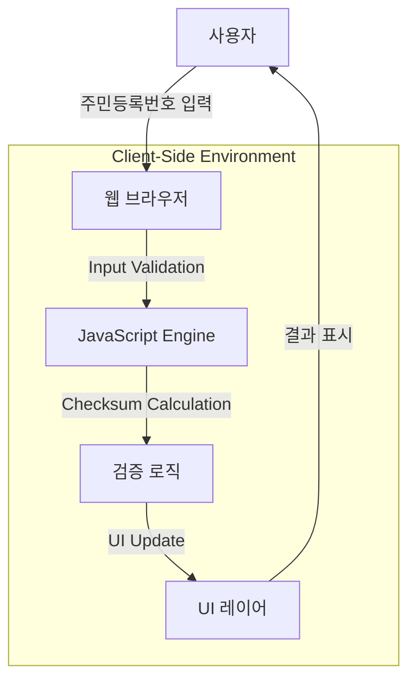

# 주민등록번호 유효성 검사기 (Ssn Validator)

---

## 1. 프로젝트 소개
본 프로젝트는 웹 폼에서 주민등록번호 입력을 받는 모든 서비스 및 개인정보 보안을 중요시하는 사용자를 대상으로 대한민국 주민등록번호 체계에 기반하여 브라우저 내에서 즉각적인 유효성 검증을 수행하는 웹 서비스입니다.

---

## 2. 프로젝트 개요
- **제작 배경**: 기존의 주민등록번호 입력 폼에서 발생하는 사용자 입력 오류와 개인정보 유출 우려를 해소하고자 기획.
- **기획 의도**: 서버 통신 없는 클라이언트 사이드 검증을 통해 보안성을 극대화하고 사용자 경험을 개선함.
- **프로젝트 목표**: 외부 라이브러리 없이 순수 바닐라 JS만으로 신뢰성 있는 유효성 검증 인터페이스 구현.

---

## 3. 주요 기능
- **실시간 비숫자 필터링**: 잘못된 문자 입력 차단.
- **자동 포커스 이동 (Auto Focus)**: 6자리 입력 시 뒷자리로 자동 포커스.
- **체크섬 기반 검증**: 주민등록번호 가중치 공식을 적용한 검증 (검사 버튼 클릭 또는 입력창에서 Enter 시 실행).
  - 검증 범위는 체크섬(검증 숫자) 일치 여부이며, 생년월일·성별 자리·지역코드 유효성은 검사하지 않음.
- **보안 강화**: 폼 전송 차단 및 뒷자리 마스킹 처리.
- **키보드 중심 입력 흐름**: 앞/뒷자리 어디서든 Enter로 검사 실행 뒷자리가 비었을 때 Backspace로 앞자리 복귀.
- **스마트 붙여넣기**: `900101-1234567`처럼 하이픈이 섞인 번호를 붙여넣으면 비숫자를 제거하고 앞 6자리/뒤 7자리로 자동 분리.
- **Reset 시 결과 초기화**: 입력값과 함께 이전 검사 결과 문구도 처음 안내문으로 복구.

---

## 4. 기술 스택
- **언어 및 도구**: HTML5, SCSS (CSS3), JavaScript (Vanilla JS ES6+)

---

## 5. 기술 선택 이유
- **Vanilla JavaScript**: 직접 작성한 JS/CSS를 합쳐 약 6KB 수준으로 가볍게 유지하고 브라우저 네이티브 DOM 처리를 활용하기 위함.
- **SCSS (Sass)**: 중첩(Nesting) 구조와 변수/믹스인을 통해 스타일 시트의 재사용성을 높이고 유지보수 효율성을 향상하기 위함.

---

## 6. 시스템 아키텍처
- 클라이언트 단독 구조(Client-only)로 서버 호출 없이 브라우저 로컬 스코프 내에서 모든 연산 처리.


```mermaid
graph TD
    User[사용자] -->|주민등록번호 입력| Browser[웹 브라우저]
    subgraph Client_Side [Client-Side Environment]
        Browser -->|Input Validation| Script[JavaScript Engine]
        Script -->|Checksum Calculation| Validation[검증 로직]
        Validation -->|UI Update| View[UI 레이어]
    end
    View -->|결과 표시| User
```

---

## 7. 프로젝트 폴더 구조
```bash
portfolio/ssnvalidation/
├── README.md
├── build/
│   ├── css/ssn.css
│   └── script/ssn.js
├── public/
│   └── favicon/
└── src/
    ├── html/ssn.html
    ├── scss/ssn.scss
    └── build/css/ssn.css   # build/css/ssn.css와 동일한 사본
```

---

## 8. 트러블슈팅
각 항목은 **문제 → 원인 → 해결 → 검증** 순서입니다. 검증 결과는 9번 표에 있습니다.

### 8-1. 입력 흐름: 마우스 없이 끝까지 입력할 수 없음
- **문제**: 앞자리 입력 후 마우스로 뒷자리를 클릭해야 했고 키보드만으로는 검사까지 이어지지 않음.
- **원인**: 입력창 간 포커스 이동과 키 이벤트 처리가 없었음 Enter는 뒷자리에서만 동작했고 뒷자리를 지우다 앞자리로 돌아갈 방법이 없었음.
- **해결**: `input` 이벤트로 6자리 입력 시 뒷자리 자동 포커스 앞/뒷자리 공통 Enter 검사 뒷자리가 빈 상태에서 Backspace 시 앞자리로 복귀.
- **검증**: 해당 4개 케이스 통과 (9번 표).

### 8-2. 붙여넣기: `900101-1234567`을 붙여넣으면 값이 깨짐
- **문제**: 하이픈이 포함된 번호를 붙여넣으면 앞자리에 `900101`만 남고 나머지가 사라지거나, 뒷자리에서는 숫자가 6자리로 줄어듦.
- **원인**: `maxlength`가 `input` 이벤트 필터링보다 **먼저** 값을 잘라냄 필터링 코드만으로는 이미 잘린 값을 복구할 수 없음.
- **해결**: `paste` 이벤트에서 클립보드 문자열의 비숫자를 직접 제거한 뒤 앞자리 6자리 / 뒷자리 7자리로 나눠 채우고 뒷자리로 포커스 이동 6자리 이하는 기존 필터링 경로를 그대로 사용.
- **검증**: 변경 전 코드는 해당 2개 케이스 실패, 변경 후 통과.

### 8-3. 검사 후 Reset 해도 이전 결과가 남음
- **문제**: Reset 버튼이 입력값만 지우고 "올바른 주민등록번호 입니다." 같은 이전 결과 문구는 그대로 남아 사용자가 혼동.
- **원인**: 브라우저 기본 `reset`은 폼 입력값만 초기화하고 스크립트가 바꾼 결과 영역 텍스트는 건드리지 않음.
- **해결**: `reset` 이벤트에서 결과 문구를 최초 안내문으로 복구하고 앞자리로 포커스.
- **검증**: 변경 전 코드는 실패, 변경 후 통과.

### 8-4. 보안: 입력값이 네트워크로 나갈 가능성 차단
- **문제**: 일반 폼 전송(GET/POST)을 쓰면 주민등록번호가 요청에 실려 나감.
- **해결**: `onsubmit="return false;"`로 폼 전송을 막고 검증을 JS 로컬 연산으로만 수행. 뒷자리는 `type="password"`로 마스킹.
- **확인 방법**: `build/script/ssn.js`에 `fetch` · `XMLHttpRequest` · `sendBeacon` · `WebSocket` 호출이 없음 (코드 검색으로 확인).

---

## 9. 테스트 결과
- **방법**: Node.js에서 DOM을 모의(stub)하고 **실제 배포 코드 `build/script/ssn.js`를 그대로 실행**. 테스트용 번호는 가중치 공식으로 생성한 가상의 번호이며 실존 번호가 아님.
- **전체**: 변경 후 **20 / 20 통과**. 이번에 추가한 기능이 빠진 변경 전 코드는 **15 / 20** (실패 5건이 모두 추가 기능에 해당).

| 구분 | 케이스 | 결과 |
|---|---|---|
| 체크섬 | 유효 번호 4건 → "올바른 주민등록번호 입니다." | 통과 |
| 체크섬 | 위 번호에서 검증 숫자만 1 틀리게 한 4건 → "올바른 주민등록번호가 아닙니다." | 통과 |
| 자릿수 | 앞 5자리 → 경고 후 앞자리 포커스 / 뒤 3자리 → 경고 후 뒷자리 포커스 | 통과 |
| 입력 필터 | `90a0-1b` 입력 → `9001` | 통과 |
| 자동 포커스 | 6자리 입력 시 이동 / 6자리 미만은 이동 없음 | 통과 |
| Enter | 뒷자리 Enter / 앞자리 Enter → 검사 실행 | 통과 |
| Backspace | 뒷자리 빈 상태 → 앞자리 이동 / 값이 있으면 이동 없음 | 통과 |
| 붙여넣기 | `900101-1234568` 앞자리 붙여넣기 → 6/7 자리로 분리 | 통과 |
| 붙여넣기 | `-1234567890` 뒷자리 붙여넣기 → 하이픈 제거, 7자리 제한 | 통과 |
| Reset | 결과 문구가 최초 안내문으로 복구 | 통과 |

> 실제 브라우저의 클릭/IME 입력까지 자동화한 테스트는 아닙니다. 브라우저 동작은 `src/html/ssn.html`을 열어 수동으로 확인합니다.

**체크섬 계산 예시** (`900101` + `123456` + 검증 숫자)
- 가중합: 9×2 + 0×3 + 0×4 + 1×5 + 0×6 + 1×7 + 1×8 + 2×9 + 3×2 + 4×3 + 5×4 + 6×5 = **124**
- `124 % 11 = 3` → `(11 − 3) % 10 = 8` → 13번째 숫자가 **8**이면 유효.

---

## 10. 성능 및 로드 개선
| 항목 | 변경 전 | 변경 후 |
|---|---|---|
| 직접 작성 HTML | - | 1,933 B (gzip 852 B) |
| 직접 작성 CSS | 4,113 B | 4,113 B (gzip 1,225 B) |
| 직접 작성 JS | 2,346 B | 4,041 B (gzip 1,570 B) |

- JS가 늘어난 것은 8-1 ~ 8-3의 입력 개선 기능을 추가했기 때문입니다.
- 서버 통신이 없어 검증은 클릭/Enter 시 동기적으로 즉시 실행됩니다. (응답 시간 수치는 측정하지 않았으므로 기재하지 않습니다.)

---

## 11. 한계 및 개선 예정
- 검증 범위는 **체크섬**뿐이며 생년월일 · 성별 자리 · 지역코드는 검사하지 않음.
- **2020년 10월 이후 발급된 번호는 임의번호 체계**라 체크섬 규칙을 따르지 않음 → 유효한 번호가 "올바르지 않음"으로 나올 수 있음.
- 외국인등록번호는 별도 보정식이 필요해 미지원.
- 접근성(label, `aria-live`)과 자릿수 오류의 `alert()` 대체는 미적용.

---

## 12. 실행 및 테스트 방법
- **로컬 환경 요구사항**: 최신 모던 웹 브라우저 (Chrome, Edge, Firefox 등)
- **실행**: 빌드 없이 `src/html/ssn.html`을 브라우저로 오픈. (`../../build/`를 상대경로로 참조하므로 폴더 구조 유지 필요)
- **SCSS 수정 시**: `src/scss/ssn.scss`를 직접 컴파일해 `build/css/ssn.css`에 반영 (별도 빌드 스크립트 없음)
- **수동 테스트**: `900101-1234568` 형태 번호를 붙여넣어 분리 확인 → 검사 → Reset 순서로 확인.
